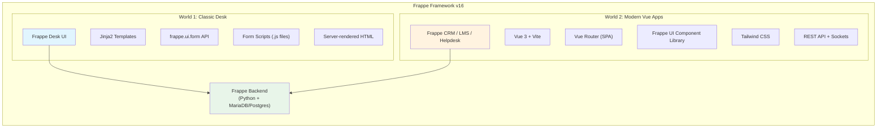
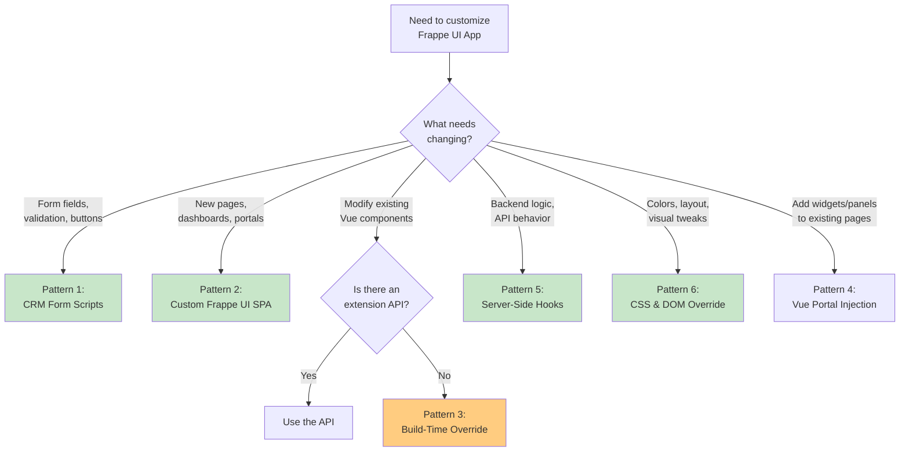

# Frappe UI Customization Patterns for v16+

> A comprehensive guide to overriding and extending Frappe UI-based applications (CRM, LMS, Helpdesk, etc.) in Frappe Framework version 16 and above.

---

## What is This Repository?

This documentation repository analyzes the state of UI customization in Frappe Framework v16+, evaluates the relevance of legacy approaches (like the popular `crm_override` method), and provides **six actionable, production-ready patterns** for extending Vue-based Frappe applications.

### Origins: The `crm_override` Method

Two years ago (2024), [Safwan Erooth (@esafwan)](https://github.com/esafwan/crm_override) published a clever workaround called `crm_override` that demonstrated how to override Vue components in Frappe CRM from a custom app. The technique used a Node.js build script to:

1. Copy the entire `src` directory from the target app (`crm/frontend/src`)
2. Overlay files from a `src_override` folder to replace specific components
3. Build a new frontend bundle with the modified source

This method was innovative for its time and remains **functionally possible** in Frappe v16. However, the Frappe ecosystem has matured significantly. Today, there are better, more maintainable approaches depending on your specific needs.

### Is `crm_override` Still Relevant in Frappe v16?

**Short answer: It works, but it is no longer the recommended approach for most scenarios.**

| Factor | Assessment in v16 |
|--------|-------------------|
| **Functional** | Yes - The build-time copy-and-replace technique still functions |
| **Recommended** | No - There are now better alternatives for most use cases |
| **Maintenance Burden** | High - You inherit the entire upstream source and must track changes |
| **Multi-tenancy** | Not safe - Overrides affect all sites on the bench |
| **Upgrade Risk** | High - Upstream component changes can silently break your overrides |
| **Best For** | Deep UI surgery when no extension API exists |

---

## Architecture Overview

### Understanding the Two Frontend Worlds



**Key Insight:** Frappe v16 contains two distinct UI architectures running in parallel. The classic Desk uses server-rendered pages with jQuery-based forms, while modern apps like CRM, LMS, and Helpdesk are fully decoupled Vue 3 SPAs. Customization techniques from one world do not apply to the other.

### How Modern Frappe UI Apps Work

```mermaid
sequenceDiagram
    participant User
    participant Browser
    participant "Vue SPA<br/>(CRM/LMS)" as VueApp
    participant "Frappe Backend" as Backend
    participant "Database" as DB

    User->>Browser: Navigate to /crm
    Browser->>Backend: GET /crm
    Backend-->>Browser: index.html + bundled JS/CSS
    Browser->>VueApp: Initialize Vue App
    
    User->>VueApp: Open Lead form
    VueApp->>Backend: GET /api/resource/CRM Lead/LEAD-001
    Backend->>DB: Query document
    DB-->>Backend: Document data
    Backend-->>VueApp: JSON response
    
    VueApp->>Backend: GET /api/method/getdoctype (metadata)
    Backend-->>VueApp: Field schema, permissions, depends_on
    
    VueApp->>Backend: GET CRM Form Scripts (from DB)
    Backend-->>VueApp: Class-based JS
    
    VueApp->>VueApp: Render form with reactive data
    VueApp->>User: Display interactive form
```

---

## The Six Patterns at a Glance

| # | Pattern | When to Use | Complexity | Maintenance | v16+ Ready |
|---|---------|-------------|------------|-------------|------------|
| 1 | **CRM Form Scripts** | Field logic, validation, dialogs, buttons in CRM forms | Low | Low | Yes |
| 2 | **Custom Frappe UI SPA** | Standalone custom interface, dashboards, portals | Medium | Low | Yes |
| 3 | **Build-Time Source Override** | Deep component modification when no API exists | High | High | Caution |
| 4 | **Vue Portal Injection** | Add widgets, panels, floating elements to existing pages | Medium | Medium | Yes |
| 5 | **Server-Side Extension Hooks** | Backend logic, validation, API modification | Low | Low | Yes |
| 6 | **CSS & DOM Override** | Visual theming, hide/show elements, style tweaks | Low | Low | Yes |

---

## Pattern Selection Flowchart



---

## Detailed Recommendations by Scenario

### Scenario 1: Customize CRM/LMS Form Behavior
**Recommendation:** Use **Pattern 1 - CRM Form Scripts** (class-based). These are stored in the database, require no build step, are multi-tenant safe, and apply immediately.

### Scenario 2: Build a Custom Dashboard or Portal
**Recommendation:** Use **Pattern 2 - Custom Frappe UI SPA**. Scaffold a new Vue 3 app with `frappe-ui-starter`, mount it at its own route, and communicate via REST API.

### Scenario 3: Add a Menu Item to CRM Sidebar
**Recommendation:** If Frappe CRM exposes a settings/config API for sidebar items, use that. If not, **Pattern 1** with a custom button, or **Pattern 4** to inject a Vue component into the sidebar DOM. As a last resort, consider **Pattern 3**.

### Scenario 4: Modify an Existing Vue Component's Template
**Recommendation:** **Pattern 3 - Build-Time Source Override** is the only option when the component doesn't expose slots or extension points. Document your overrides meticulously and pin the upstream app version.

### Scenario 5: Add Server-Side Validation or Logic
**Recommendation:** **Pattern 5 - Server-Side Extension Hooks** (`extend_doctype_class`, `doc_events`, `override_whitelisted_methods`). Never put business logic in frontend code.

### Scenario 6: Change Colors, Fonts, Spacing
**Recommendation:** **Pattern 6 - CSS & DOM Override**. Use CSS custom properties, `app_include_css`, and client-side JavaScript for visual-only changes.

---

## Repository Structure

```
frappe-ui-customization-patterns/
├── README.md                          # This file - overview and recommendations
├── pattern-01-crm-form-scripts/
│   └── README.md                      # Class-based form scripts for CRM/LMS
├── pattern-02-custom-frappe-ui-spa/
│   └── README.md                      # Standalone Vue 3 SPA
├── pattern-03-build-time-source-override/
│   └── README.md                      # The original crm_override method
├── pattern-04-vue-portal-injection/
│   └── README.md                      # Vue Teleport for DOM injection
├── pattern-05-server-side-extension-hooks/
│   └── README.md                      # Python backend hooks
└── pattern-06-css-dom-override/
    └── README.md                      # Theming and visual overrides
```

---

## Critical Warnings for Production

### 1. The `crm_override` Method is a Last Resort
The build-time source override technique from the original `crm_override` repository should be considered a **last resort** when no other pattern can achieve your goal. It is powerful but carries significant technical debt.

### 2. Version Pinning is Non-Negotiable
If you use Pattern 3 (Build-Time Override), you **must** pin the exact version of the upstream app in your `pyproject.toml` or installation scripts. A minor upstream update can break your override in unpredictable ways.

### 3. Test After Every Upstream Update
When the upstream app (CRM, LMS, etc.) releases a new version, your overrides must be re-tested. Consider automated visual regression testing with tools like Playwright.

### 4. Separate Concerns
Never put business logic in Vue component overrides. Use server-side hooks (Pattern 5) for validation, calculations, and data integrity. Use frontend patterns only for presentation and interaction.

### 5. Document Everything
Every override should be documented with:
- What is being overridden and why
- The upstream file path and version
- What changes were made
- Date of override
- Person responsible

---

## Quick Reference: Frappe v16 Hooks Cheat Sheet

```python
# hooks.py - v16+ customization hooks

# Classic Desk form scripts (still works for Desk, not for Vue apps)
doctype_js = {
    "Sales Order": "public/js/sales_order.js"
}

# Extend DocType class safely (v16+, preferred over override)
extend_doctype_class = {
    "Sales Invoice": ["my_app.extensions.si_extension.SalesInvoiceMixin"]
}

# Override DocType class completely (use sparingly)
override_doctype_class = {
    "ToDo": "my_app.overrides.todo.CustomToDo"
}

# Override whitelisted methods
override_whitelisted_methods = {
    "frappe.client.get_list": "my_app.overrides.custom_get_list"
}

# Include CSS/JS in Desk
desk_assets = {
    "app_include_js": "public/js/my_app.js",
    "app_include_css": "public/css/my_app.css"
}

# Document events (server-side)
doc_events = {
    "Sales Order": {
        "on_submit": "my_app.api.validate_order",
        "validate": "my_app.api.check_credit_limit"
    }
}
```

---

## Additional Resources

- [Frappe Framework Documentation](https://docs.frappe.io/framework/user/en)
- [Frappe UI Component Library](https://github.com/frappe/frappe-ui)
- [Frappe CRM GitHub Repository](https://github.com/frappe/crm)
- [Class-Based Client Scripts Blog Post](https://frappe.io/blog/engineering/class-based-client-scripts-for-frappe-crm)
- [Original crm_override Repository](https://github.com/esafwan/crm_override)

---

## License

This documentation is provided under the MIT License. Code examples are provided as-is for educational and development purposes.
