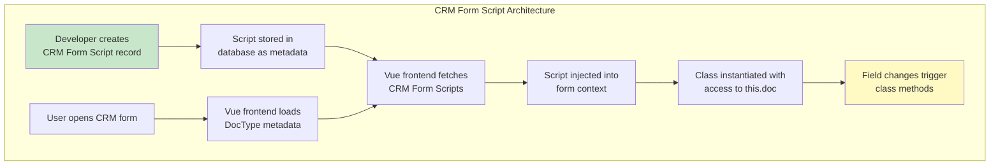
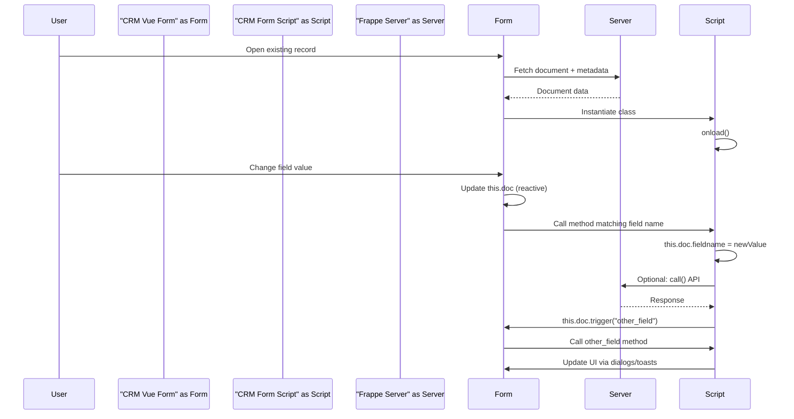

# Pattern 1: CRM Form Scripts

> The **recommended, supported, and safest** way to customize behavior in Frappe CRM, LMS, and other modern Frappe UI applications. No build step. No source override. Changes apply immediately.

---

## Table of Contents

- [What This Pattern Does](#what-this-pattern-does)
- [When to Use This Pattern](#when-to-use-this-pattern)
- [Why We Use This Pattern](#why-we-use-this-pattern)
- [Architecture](#architecture)
- [How It Works](#how-it-works)
- [Step-by-Step Guide](#step-by-step-guide)
- [Complete Code Examples](#complete-code-examples)
- [Reference: Global Helper Functions](#reference-global-helper-functions)
- [Reference: Lifecycle and Event Flow](#reference-lifecycle-and-event-flow)
- [Limitations](#limitations)
- [Common Patterns](#common-patterns)

---

## What This Pattern Does

CRM Form Scripts allow you to inject JavaScript logic into Frappe CRM (and other Vue-based Frappe apps) forms without modifying any source code. Scripts are stored as database records and executed dynamically by the Vue frontend at runtime.

Capabilities include:
- Field-level change handlers
- Form lifecycle hooks (`onload`, `onchange`)
- Dialog creation and management
- Server API calls
- Field visibility and property toggling
- Toast notifications and user feedback

---

## When to Use This Pattern

| Use This Pattern | Don't Use This Pattern |
|-----------------|----------------------|
| Add validation on field changes | Modify Vue component templates |
| Show/hide fields based on conditions | Add new sidebar navigation items |
| Open dialogs on status changes | Override router behavior |
| Call server APIs from form events | Change the overall app layout |
| Set field values dynamically | Modify list view components |
| Add computed field behavior | Deep UI structural changes |

**Specific scenarios:**
- When a CRM Lead status changes to "Lost", show a dialog to capture the reason
- When a Deal's amount exceeds a threshold, require manager approval
- Auto-populate fields based on another field's value
- Validate child table entries

---

## Why We Use This Pattern

| Advantage | Explanation |
|-----------|-------------|
| **No Build Step** | Changes are stored in DB and take effect immediately |
| **Multi-tenant Safe** | Different sites can have different scripts without code changes |
| **Cloud Compatible** | Works on Frappe Cloud without deployment |
| **Zero Maintenance Overhead** | No tracking upstream source changes |
| **Upgrade Safe** | Survives app updates without modification |
| **Reversible** | Disable or delete the script record to undo changes |
| **Scoped** | Scripts run only in the target DocType's form |

---

## Architecture



---

## How It Works

### The Class-Based Syntax

Unlike classic Desk forms that use `frappe.ui.form.on("DocType", {...})`, CRM Form Scripts use ES6 classes:

```javascript
class MyDocType {
    // Method name = field name = automatic trigger
    status() {
        // Called automatically when 'status' field changes
        // Access document via this.doc
        if (this.doc.status === "Lost") {
            this.showLossReasonDialog();
        }
    }
    
    onload() {
        // Called when form loads (saved documents only)
        console.log("Form loaded:", this.doc.name);
    }
}
```

**Key rules:**
- The class name must match the DocType name (with spaces removed)
- Method names matching field names are automatically called on field change
- `this.doc` provides reactive access to the document
- `this.doc.trigger('fieldname')` triggers another field's method
- `this.doc.getRow('child_table', idx)` accesses child table rows

---

## Step-by-Step Guide

### Step 1: Navigate to CRM Form Scripts

1. Open your Frappe site
2. Go to **CRM > Settings > CRM Form Script** (or search "CRM Form Script" in Awesomebar)

### Step 2: Create a New Script

1. Click **New**
2. Set **DT (DocType)** to the target DocType (e.g., `CRM Deal`)
3. Paste your class-based script in the **Script** field
4. Save and enable the script

### Step 3: Test Immediately

1. Open a record of the target DocType in CRM
2. Make changes to trigger your script
3. Check browser console for errors

### Alternative: Script via API

You can also create scripts programmatically:

```python
import frappe

script = frappe.get_doc({
    "doctype": "CRM Form Script",
    "dt": "CRM Deal",
    "script": """class CRMDeal {
    status() {
        if (this.doc.status === "Won") {
            toast.success("Deal won! Champagne time!");
        }
    }
}""",
    "enabled": 1
})
script.insert()
```

---

## Complete Code Examples

### Example 1: Basic Field Change Handler

```javascript
// CRM Form Script for "CRM Deal"
// Trigger: When category field changes

class CRMDeal {
    category() {
        // Auto-set subcategory based on category
        if (this.doc.category === "Enterprise") {
            this.doc.subcategory = "Large Account";
        } else if (this.doc.category === "SMB") {
            this.doc.subcategory = "Small Business";
        }
        // Trigger validation on subcategory
        this.doc.trigger("subcategory");
    }
}
```

### Example 2: Dialog on Status Change

```javascript
// CRM Form Script for "CRM Lead"
// Trigger: Show dialog when status changes to "Lost"

class CRMLead {
    // Runs when saved record loads
    onload() {
        console.log("Lead loaded:", this.doc.name);
    }

    // Called automatically when status field changes
    status() {
        if (this.doc.status === "Lost") {
            this.showLossReasonDialog();
        }
    }

    async showLossReasonDialog() {
        const me = this;
        
        // Fetch loss reasons from server
        const reasons = await call("frappe.desk.search.search_link", {
            doctype: "CRM Lost Reason",
            txt: "",
            filters: []
        });

        const options = reasons
            .map(r => `<option value="${r.value}">${r.value}</option>`)
            .join("");

        const html = `
            <div class="flex flex-col gap-3">
                <select id="loss_reason" required 
                    class="w-full border border-gray-300 rounded px-3 py-2">
                    <option value="" disabled selected>Select loss reason</option>
                    ${options}
                </select>
                <textarea id="loss_notes"
                    class="w-full border border-gray-300 rounded px-3 py-2"
                    rows="3" placeholder="Additional notes (optional)"></textarea>
            </div>
        `;

        createDialog({
            title: "Record Lost Lead",
            message: "Please provide the reason for losing this lead.",
            html: html,
            actions: [
                {
                    label: "Save",
                    variant: "solid",
                    async onClick(close) {
                        const reasonEl = document.getElementById("loss_reason");
                        if (!reasonEl.value) {
                            toast.error("Please select a reason");
                            return;
                        }
                        
                        await call("frappe.client.set_value", {
                            doctype: "CRM Lead",
                            name: me.doc.name,
                            fieldname: {
                                custom_loss_reason: reasonEl.value,
                                custom_loss_notes: document.getElementById("loss_notes").value
                            }
                        });
                        
                        close();
                        toast.success("Loss reason recorded");
                    }
                },
                {
                    label: "Cancel",
                    variant: "outline",
                    onClick(close) {
                        close();
                    }
                }
            ]
        });
    }
}
```

### Example 3: Server API Call with Loading State

```javascript
// CRM Form Script for "CRM Deal"
// Validates credit limit by calling server method

class CRMDeal {
    async annual_contract_value() {
        if (!this.doc.annual_contract_value || this.doc.annual_contract_value <= 0) {
            return;
        }
        
        try {
            const result = await call("my_custom_app.api.validate_credit_limit", {
                customer: this.doc.customer,
                amount: this.doc.annual_contract_value
            });
            
            if (!result.valid) {
                createDialog({
                    title: "Credit Limit Exceeded",
                    message: `Customer credit limit: ${result.currency} ${result.limit_formatted}<br/>
                              Deal value: ${result.currency} ${result.amount_formatted}<br/><br/>
                              Approval required from ${result.approver}.`,
                    actions: [
                        {
                            label: "Request Approval",
                            variant: "solid",
                            async onClick(close) {
                                await call("my_custom_app.api.request_approval", {
                                    deal: me.doc.name,
                                    customer: me.doc.customer
                                });
                                toast.success("Approval request sent");
                                close();
                            }
                        },
                        {
                            label: "Cancel",
                            variant: "outline",
                            onClick(close) { close(); }
                        }
                    ]
                });
            }
        } catch (e) {
            toast.error("Failed to validate credit limit");
            console.error(e);
        }
    }
}
```

### Example 4: Child Table Interaction

```javascript
// CRM Form Script for "CRM Deal"
// Parent-to-child and child-to-parent triggering

class CRMDeal {
    // When discount percentage changes at parent level,
    // update all line items
    discount_percent() {
        const rows = this.doc.getRows("items") || [];
        rows.forEach((row, idx) => {
            const rowObj = this.doc.getRow("items", idx);
            rowObj.discount = this.doc.discount_percent;
            rowObj.trigger("discount");  // Trigger row's discount handler
        });
    }
    
    // Calculate grand total when items change
    items_on_update() {
        let total = 0;
        const rows = this.doc.getRows("items") || [];
        rows.forEach(row => {
            total += (row.rate * row.qty * (1 - row.discount / 100));
        });
        this.doc.grand_total = total;
    }
}

// Child table script (if supported by your CRM version)
class CRMDealItem {
    qty() {
        this.calculate_amount();
    }
    
    rate() {
        this.calculate_amount();
    }
    
    discount() {
        this.calculate_amount();
    }
    
    calculate_amount() {
        this.row.amount = this.row.rate * this.row.qty * (1 - this.row.discount / 100);
        // Notify parent to recalculate
        this.doc.trigger("items_on_update");
    }
}
```

### Example 5: Router Navigation

```javascript
// CRM Form Script for "CRM Lead"
// Navigate to related contact

class CRMLead {
    async view_contact() {
        if (!this.doc.contact) {
            toast.info("No contact linked to this lead");
            return;
        }
        
        // Navigate to contact page
        router.push(`/contacts/${this.doc.contact}`);
    }
    
    // Add a custom button-like behavior
    onload() {
        // Note: Actual button API is planned for future releases
        // For now, use field-based triggers or custom fields
        console.log("Lead loaded - custom onload executed");
    }
}
```

---

## Reference: Global Helper Functions

The following helpers are available globally in CRM Form Scripts:

| Function | Purpose | Example |
|----------|---------|---------|
| `call(method, args)` | Call whitelisted server method | `await call("frappe.client.get", {...})` |
| `createDialog(options)` | Show modal dialog | See Example 2 above |
| `toast.success(message)` | Show success toast | `toast.success("Saved!")` |
| `toast.error(message)` | Show error toast | `toast.error("Validation failed")` |
| `toast.info(message)` | Show info toast | `toast.info("Processing...")` |
| `router.push(path)` | Navigate to route | `router.push("/deals/DEAL-001")` |
| `socket.emit(event, data)` | Emit socket event | `socket.emit("refresh_leads")` |

---

## Reference: Lifecycle and Event Flow



### Lifecycle Hook Availability

| Hook | When Called | New Documents | Saved Documents |
|------|-------------|---------------|-----------------|
| `onload` | After form renders and data loads | No | Yes |
| `onchange` (field-level) | When field value changes | Yes | Yes |
| Field-named methods | When that specific field changes | Yes | Yes |

**Important:** CRM Form Scripts do NOT run on new (unsaved) forms for `onload`, because the document has no name yet and scripts are attached after render.

---

## Limitations

1. **Cannot modify Vue components** - You cannot change templates, add sidebar items, or modify the router. Use Pattern 2 or 3 for that.
2. **No new/save document hooks** - `validate`, `before_save`, `after_save` are not available (use server-side `doc_events` hooks instead).
3. **Button API limited** - Adding custom toolbar buttons is planned but not universally available.
4. **onload only for saved docs** - New documents don't trigger `onload`.
5. **Depends on frontend support** - The specific CRM/LMS version must support CRM Form Scripts.

---

## Common Patterns

### Pattern: Conditional Field Visibility

While you can't directly toggle visibility in scripts (CRM reads from DocType metadata), use DocType-level `depends_on`:

```
# In DocType definition
Field: "loss_reason"
Depends On: eval:doc.status=="Lost"
Mandatory Depends On: eval:doc.status=="Lost"
```

The Vue renderer will automatically show/hide fields based on these expressions.

### Pattern: Cascade Dropdowns

```javascript
class CRMLead {
    async country() {
        if (!this.doc.country) return;
        
        // Fetch states for selected country
        const states = await call("frappe.client.get_list", {
            doctype: "State",
            filters: { country: this.doc.country },
            fields: ["name"],
            limit: 100
        });
        
        // Store for use in state field options
        // Note: Dynamic options require field configuration
        // or custom field setup
        console.log("Available states:", states.map(s => s.name));
    }
}
```

### Pattern: Real-time Collaboration

```javascript
class CRMDeal {
    onload() {
        // Listen for socket events
        socket.on(`deal_updated:${this.doc.name}`, (data) => {
            toast.info(`Deal updated by ${data.modified_by}`);
            this.doc.trigger("reload");
        });
    }
}
```
