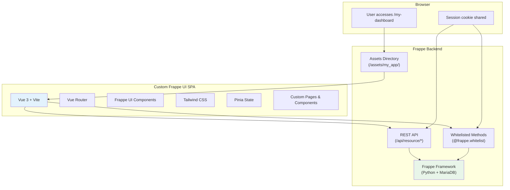
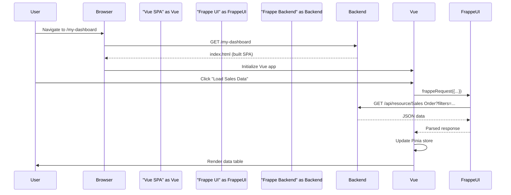

# Pattern 2: Custom Frappe UI SPA

> Build a standalone Vue 3 Single Page Application that integrates with Frappe's backend. Best for custom dashboards, portals, and independent interfaces that coexist with existing Frappe UI apps.

---

## Table of Contents

- [What This Pattern Does](#what-this-pattern-does)
- [When to Use This Pattern](#when-to-use-this-pattern)
- [Why We Use This Pattern](#why-we-use-this-pattern)
- [Architecture](#architecture)
- [Step-by-Step Guide](#step-by-step-guide)
- [Complete Code Examples](#complete-code-examples)
- [Integrating with Existing Apps](#integrating-with-existing-apps)
- [Authentication & Session Management](#authentication--session-management)
- [Production Build & Deployment](#production-build--deployment)
- [Common Patterns](#common-patterns)

---

## What This Pattern Does

This pattern creates a completely new Vue 3 Single Page Application (SPA) using the official `frappe-ui-starter` template. Your app:

- Lives at its own URL route (e.g., `/my-dashboard`)
- Uses the Frappe UI component library for consistent design
- Communicates with Frappe backend via REST API and `frappeRequest`
- Shares authentication with the main Frappe session
- Can be accessed from the Frappe Desk or linked from other apps

---

## When to Use This Pattern

| Use This Pattern | Don't Use This Pattern |
|-----------------|----------------------|
| Custom dashboards and analytics | Small form-level tweaks (use Pattern 1) |
| Customer portals and self-service | Modifying existing app components (use Pattern 3) |
| Reporting interfaces with complex UI | Simple visual changes (use Pattern 6) |
| Independent tools that need full UI control | Adding a single button to existing forms |
| Data visualization and charts | Backend-only modifications (use Pattern 5) |

**Specific scenarios:**
- Executive dashboard with charts and KPIs
- Customer self-service portal
- Advanced reporting with custom filters
- Integration hub showing external data

---

## Why We Use This Pattern

| Advantage | Explanation |
|-----------|-------------|
| **Full Vue 3 Power** | Complete control over components, routing, state management |
| **Frappe UI Components** | Use official Button, Dialog, Input, ListView, etc. |
| **Backend Integration** | Automatic API authentication, CSRF handling, request utilities |
| **Independent Lifecycle** | Your frontend can be built and deployed independently |
| **Officially Supported** | Uses Frappe's recommended tooling |
| **Scalable** | Can grow into a full-featured application |
| **No Source Conflicts** | Doesn't touch upstream app code at all |

---

## Architecture



### Request Flow



---

## Step-by-Step Guide

### Step 1: Create a Frappe App

```bash
cd ~/frappe-bench

# Create new app
bench new-app my_dashboard
# Fill in prompts: title, description, publisher, email, license

# Install on your site
bench --site dev.localhost install-app my_dashboard
```

### Step 2: Scaffold the Frontend

```bash
cd apps/my_dashboard

# Use official Frappe UI starter
npx degit frappe/frappe-ui-starter frontend

# Install dependencies
cd frontend
yarn

# For development: allow CSRF
bench --site dev.localhost set-config ignore_csrf 1
```

### Step 3: Configure main.js

```javascript
// frontend/src/main.js
import { createApp } from 'vue'
import {
    FrappeUI,
    setConfig,
    frappeRequest,
    resourcesPlugin,
    pageMetaPlugin
} from 'frappe-ui'
import App from './App.vue'
import router from './router'
import './index.css'

let app = createApp(App)

// Register FrappeUI plugin (components + directives)
app.use(FrappeUI)

// Enable Frappe response parsing with automatic auth
setConfig('resourceFetcher', frappeRequest)

// Optional: Options API resource support
app.use(resourcesPlugin)

// Optional: Reactive page titles
app.use(pageMetaPlugin)

// Register router
app.use(router)

app.mount('#app')
```

### Step 4: Configure the Router

```javascript
// frontend/src/router.js
import { createRouter, createWebHistory } from 'vue-router'
import Dashboard from './pages/Dashboard.vue'
import SalesReport from './pages/SalesReport.vue'
import CustomerPortal from './pages/CustomerPortal.vue'

const routes = [
    {
        path: '/',
        name: 'Dashboard',
        component: Dashboard,
        meta: { title: 'My Dashboard' }
    },
    {
        path: '/sales-report',
        name: 'SalesReport',
        component: SalesReport,
        meta: { title: 'Sales Report' }
    },
    {
        path: '/customer-portal/:customerId?',
        name: 'CustomerPortal',
        component: CustomerPortal,
        meta: { title: 'Customer Portal' },
        props: true
    }
]

const router = createRouter({
    history: createWebHistory('/my-dashboard'),
    routes
})

export default router
```

### Step 5: Create a Dashboard Page

```vue
<!-- frontend/src/pages/Dashboard.vue -->
<template>
    <div class="p-6">
        <header class="mb-8">
            <h1 class="text-2xl font-semibold text-gray-900">Executive Dashboard</h1>
            <p class="text-gray-500 mt-1">Real-time business metrics</p>
        </header>
        
        <!-- KPI Cards -->
        <div class="grid grid-cols-1 md:grid-cols-3 gap-4 mb-8">
            <KPICard 
                title="Total Sales (MTD)" 
                :value="formatCurrency(kpis.total_sales)"
                :trend="kpis.sales_trend"
                icon="trending-up"
            />
            <KPICard 
                title="Open Deals" 
                :value="kpis.open_deals"
                :subtitle="`${kpis.deals_value} potential value`"
                icon="briefcase"
            />
            <KPICard 
                title="Customer Satisfaction" 
                :value="`${kpis.csat}%`"
                :trend="kpis.csat_trend"
                icon="smile"
            />
        </div>
        
        <!-- Recent Activity -->
        <div class="bg-white rounded-lg shadow-sm border border-gray-200">
            <div class="px-6 py-4 border-b border-gray-200 flex justify-between items-center">
                <h2 class="text-lg font-medium">Recent Sales Orders</h2>
                <Button variant="outline" @click="refreshData">
                    <FeatherIcon name="refresh-cw" class="w-4 h-4 mr-2" />
                    Refresh
                </Button>
            </div>
            <div class="divide-y divide-gray-200">
                <div v-for="order in recentOrders" :key="order.name" 
                     class="px-6 py-4 hover:bg-gray-50 transition-colors">
                    <div class="flex justify-between items-center">
                        <div>
                            <p class="font-medium text-gray-900">{{ order.customer }}</p>
                            <p class="text-sm text-gray-500">{{ order.name }} - {{ order.transaction_date }}</p>
                        </div>
                        <div class="text-right">
                            <p class="font-medium text-gray-900">{{ formatCurrency(order.grand_total) }}</p>
                            <Badge 
                                :label="order.status" 
                                :variant="order.status === 'Completed' ? 'solid' : 'subtle'"
                            />
                        </div>
                    </div>
                </div>
            </div>
        </div>
    </div>
</template>

<script setup>
import { ref, onMounted } from 'vue'
import { createResource, FeatherIcon, Button, Badge } from 'frappe-ui'
import KPICard from '../components/KPICard.vue'

const kpis = ref({
    total_sales: 0,
    sales_trend: 0,
    open_deals: 0,
    deals_value: 0,
    csat: 0,
    csat_trend: 0
})

const recentOrders = ref([])

// Create a resource for fetching data
const dashboardData = createResource({
    url: 'my_dashboard.api.get_dashboard_data',
    auto: true,
    onSuccess(data) {
        kpis.value = data.kpis
        recentOrders.value = data.recent_orders
    }
})

function refreshData() {
    dashboardData.reload()
}

function formatCurrency(value) {
    return new Intl.NumberFormat('en-US', {
        style: 'currency',
        currency: 'USD'
    }).format(value || 0)
}

onMounted(() => {
    dashboardData.fetch()
})
</script>
```

### Step 6: Configure tailwind.config.js

```javascript
// frontend/tailwind.config.js
module.exports = {
    presets: [
        require('frappe-ui/src/utils/tailwind.config')
    ],
    content: [
        './index.html',
        './src/**/*.{vue,js,ts}',
        './node_modules/frappe-ui/src/components/**/*.{vue,js,ts}'
    ],
    theme: {
        extend: {
            // Your custom theme extensions
        }
    }
}
```

### Step 7: Configure package.json for Frappe Integration

```json
{
    "name": "my-dashboard",
    "private": true,
    "version": "0.0.0",
    "scripts": {
        "dev": "vite",
        "build": "vite build --base=/assets/my_dashboard/frontend/ && yarn copy-html-entry",
        "copy-html-entry": "cp ../my_dashboard/public/frontend/index.html ../my_dashboard/www/my-dashboard.html",
        "serve": "vite preview"
    },
    "dependencies": {
        "frappe-ui": "^0.1.66",
        "vue": "^3.4.0",
        "vue-router": "^4.2.0"
    },
    "devDependencies": {
        "@vitejs/plugin-vue": "^4.5.0",
        "autoprefixer": "^10.4.16",
        "postcss": "^8.4.32",
        "tailwindcss": "^3.4.0",
        "vite": "^5.0.0"
    }
}
```

### Step 8: Configure vite.config.js

```javascript
// frontend/vite.config.js
import { defineConfig } from 'vite'
import vue from '@vitejs/plugin-vue'
import path from 'path'
import frappeui from 'frappe-ui/vite'

export default defineConfig({
    plugins: [
        frappeui(),
        vue()
    ],
    resolve: {
        alias: {
            '@': path.resolve(__dirname, 'src')
        }
    },
    server: {
        port: 8080,
        proxy: {
            '^/(api|assets|files|private)': {
                target: 'http://dev.localhost:8000',
                changeOrigin: true
            }
        }
    },
    build: {
        outDir: '../my_dashboard/public/frontend',
        emptyOutDir: true
    }
})
```

### Step 9: Create the Backend API

```python
# my_dashboard/api.py
import frappe
from frappe.utils import fmt_money

@frappe.whitelist()
def get_dashboard_data():
    """Fetch data for the executive dashboard."""
    
    # Get current user's permissions automatically apply
    company = frappe.defaults.get_user_default("company")
    
    # Total sales this month
    total_sales = frappe.db.sql("""
        SELECT SUM(grand_total) as total
        FROM `tabSales Order`
        WHERE transaction_date >= DATE_FORMAT(CURDATE(), '%%Y-%%m-01')
        AND docstatus = 1
        AND company = %s
    """, company, as_dict=True)[0].total or 0
    
    # Sales trend (vs last month)
    last_month_sales = frappe.db.sql("""
        SELECT SUM(grand_total) as total
        FROM `tabSales Order`
        WHERE transaction_date >= DATE_FORMAT(DATE_SUB(CURDATE(), INTERVAL 1 MONTH), '%%Y-%%m-01')
        AND transaction_date < DATE_FORMAT(CURDATE(), '%%Y-%%m-01')
        AND docstatus = 1
        AND company = %s
    """, company, as_dict=True)[0].total or 0
    
    sales_trend = ((total_sales - last_month_sales) / last_month_sales * 100) if last_month_sales else 0
    
    # Open deals count
    open_deals = frappe.db.count("CRM Deal", {
        "status": ["not in", ["Won", "Lost", "Closed"]]
    })
    
    # Open deals value
    deals_value = frappe.db.sql("""
        SELECT SUM(annual_contract_value) as total
        FROM `tabCRM Deal`
        WHERE status NOT IN ('Won', 'Lost', 'Closed')
    """)[0].total or 0
    
    # Recent orders
    recent_orders = frappe.get_list("Sales Order",
        fields=["name", "customer", "transaction_date", "grand_total", "status"],
        filters={"docstatus": 1},
        order_by="transaction_date desc",
        limit=10
    )
    
    return {
        "kpis": {
            "total_sales": total_sales,
            "sales_trend": round(sales_trend, 1),
            "open_deals": open_deals,
            "deals_value": fmt_money(deals_value),
            "csat": 87,  # Would come from actual survey data
            "csat_trend": 2.3
        },
        "recent_orders": recent_orders
    }
```

### Step 10: Build and Integrate

```bash
cd frontend

# Development
yarn dev

# Production build
yarn build

# The build outputs to my_dashboard/public/frontend/
# and copies index.html to my_dashboard/www/my-dashboard.html
```

Add to your app's root `package.json` so `bench build` includes your frontend:

```json
{
    "scripts": {
        "build": "cd frontend && yarn build"
    }
}
```

---

## Complete Code Examples

### Example: KPICard Component

```vue
<!-- frontend/src/components/KPICard.vue -->
<template>
    <div class="bg-white rounded-lg shadow-sm border border-gray-200 p-6">
        <div class="flex items-center justify-between mb-4">
            <FeatherIcon :name="icon" class="w-5 h-5 text-gray-500" />
            <span v-if="trend !== undefined" 
                  :class="trend >= 0 ? 'text-green-600' : 'text-red-600'"
                  class="text-sm font-medium">
                {{ trend >= 0 ? '+' : '' }}{{ trend }}%
            </span>
        </div>
        <p class="text-2xl font-semibold text-gray-900">{{ value }}</p>
        <p class="text-sm text-gray-500 mt-1">{{ title }}</p>
        <p v-if="subtitle" class="text-xs text-gray-400 mt-1">{{ subtitle }}</p>
    </div>
</template>

<script setup>
import { FeatherIcon } from 'frappe-ui'

defineProps({
    title: String,
    value: [String, Number],
    subtitle: String,
    trend: Number,
    icon: String
})
</script>
```

### Example: Using frappeRequest Directly

```vue
<template>
    <div class="p-6">
        <Button @click="createTask" :loading="creating">
            Create Task
        </Button>
        
        <div v-if="tasks.length" class="mt-4 space-y-2">
            <div v-for="task in tasks" :key="task.name" 
                 class="p-3 bg-gray-50 rounded">
                {{ task.subject }} - {{ task.status }}
            </div>
        </div>
    </div>
</template>

<script setup>
import { ref } from 'vue'
import { frappeRequest, Button } from 'frappe-ui'

const tasks = ref([])
const creating = ref(false)

async function createTask() {
    creating.value = true
    try {
        const result = await frappeRequest({
            url: '/api/resource/ToDo',
            method: 'POST',
            body: {
                description: 'Follow up with customer',
                priority: 'High',
                status: 'Open'
            }
        })
        tasks.value.push(result)
        // toast is available globally
        toast.success('Task created successfully')
    } catch (error) {
        toast.error(error.message || 'Failed to create task')
    } finally {
        creating.value = false
    }
}
</script>
```

### Example: File Upload

```vue
<template>
    <div class="p-6">
        <input 
            type="file" 
            ref="fileInput" 
            @change="handleFileSelect"
            class="hidden"
            accept=".pdf,.doc,.docx"
        />
        <Button @click="$refs.fileInput.click()" variant="outline">
            <FeatherIcon name="upload" class="w-4 h-4 mr-2" />
            Select File
        </Button>
        
        <div v-if="selectedFile" class="mt-4">
            <p class="text-sm text-gray-600">{{ selectedFile.name }}</p>
            <Button @click="uploadFile" :loading="uploading" class="mt-2">
                Upload
            </Button>
        </div>
    </div>
</template>

<script setup>
import { ref } from 'vue'
import { frappeRequest, Button, FeatherIcon } from 'frappe-ui'

const fileInput = ref(null)
const selectedFile = ref(null)
const uploading = ref(false)

function handleFileSelect(event) {
    selectedFile.value = event.target.files[0]
}

async function uploadFile() {
    if (!selectedFile.value) return
    
    uploading.value = true
    const formData = new FormData()
    formData.append('file', selectedFile.value)
    formData.append('doctype', 'File')
    formData.append('is_private', '1')
    
    try {
        const result = await frappeRequest({
            url: '/api/method/upload_file',
            method: 'POST',
            body: formData,
            headers: {}  // Let browser set Content-Type with boundary
        })
        toast.success('File uploaded successfully')
        selectedFile.value = null
        fileInput.value.value = ''
    } catch (error) {
        toast.error('Upload failed: ' + error.message)
    } finally {
        uploading.value = false
    }
}
</script>
```

---

## Integrating with Existing Apps

### Add a Link from CRM to Your Dashboard

```javascript
// Create a CRM Form Script that adds navigation
class CRMDeal {
    view_dashboard() {
        // Open dashboard in new tab
        window.open('/my-dashboard', '_blank')
    }
}
```

### Add a Menu Item in Desk

```python
# my_dashboard/hooks.py

# Add to Desk sidebar
app_include_js = "/assets/my_dashboard/frontend/assets/index.js"
app_include_css = "/assets/my_dashboard/frontend/assets/index.css"

# Or create a Workspace
# Go to Desk > Workspace and create a new workspace
# with a link to /my-dashboard
```

---

## Authentication & Session Management

Frappe UI's `frappeRequest` automatically handles:
- CSRF token inclusion
- Session cookie transmission
- Authentication redirects

No manual intervention needed. If the user is logged into Frappe, they're authenticated in your SPA.

### Role-Based UI Elements

```vue
<script setup>
import { computed } from 'vue'
import { sessionStore } from 'frappe-ui'

const session = sessionStore()

const isManager = computed(() => {
    return session.user?.roles?.includes('Sales Manager')
})

const canDelete = computed(() => {
    return session.user?.roles?.some(r => 
        ['System Manager', 'Sales Manager'].includes(r)
    )
})
</script>

<template>
    <Button v-if="isManager" variant="solid">
        Approve Deal
    </Button>
    <Button v-if="canDelete" variant="danger">
        Delete
    </Button>
</template>
```

---

## Production Build & Deployment

### Build Command

```bash
cd apps/my_dashboard/frontend
yarn build
```

This creates:
- `my_dashboard/public/frontend/` - JS/CSS assets
- `my_dashboard/www/my-dashboard.html` - Entry point

### Bench Build Integration

```bash
# From bench directory
bench build --app my_dashboard

# Or build all apps
bench build
```

### Accessing the App

After installation and build:
- Navigate to `http://your-site/my-dashboard`
- The SPA handles routing internally via Vue Router

---

## Common Patterns

### Pattern: Real-time Updates with Sockets

```javascript
import { socket } from 'frappe-ui'

// Listen for real-time events
socket.on('sales_order_submitted', (data) => {
    toast.info(`New order: ${data.customer} - ${data.amount}`)
    dashboardResource.reload()
})

// Emit custom events
socket.emit('user_viewing_dashboard', {
    user: session.user,
    timestamp: new Date().toISOString()
})
```

### Pattern: Form Validation Before Submit

```vue
<script setup>
import { ref } from 'vue'

const form = ref({
    customer: '',
    amount: 0,
    description: ''
})
const errors = ref({})

function validateForm() {
    errors.value = {}
    
    if (!form.value.customer) {
        errors.value.customer = 'Customer is required'
    }
    if (!form.value.amount || form.value.amount <= 0) {
        errors.value.amount = 'Amount must be greater than zero'
    }
    if (form.value.amount > 100000) {
        errors.value.amount = 'Amount exceeds approval limit'
    }
    
    return Object.keys(errors.value).length === 0
}

async function submitForm() {
    if (!validateForm()) return
    
    try {
        await frappeRequest({
            url: '/api/resource/Sales Order',
            method: 'POST',
            body: form.value
        })
        toast.success('Sales order created')
        form.value = { customer: '', amount: 0, description: '' }
    } catch (e) {
        toast.error(e.message)
    }
}
</script>
```
