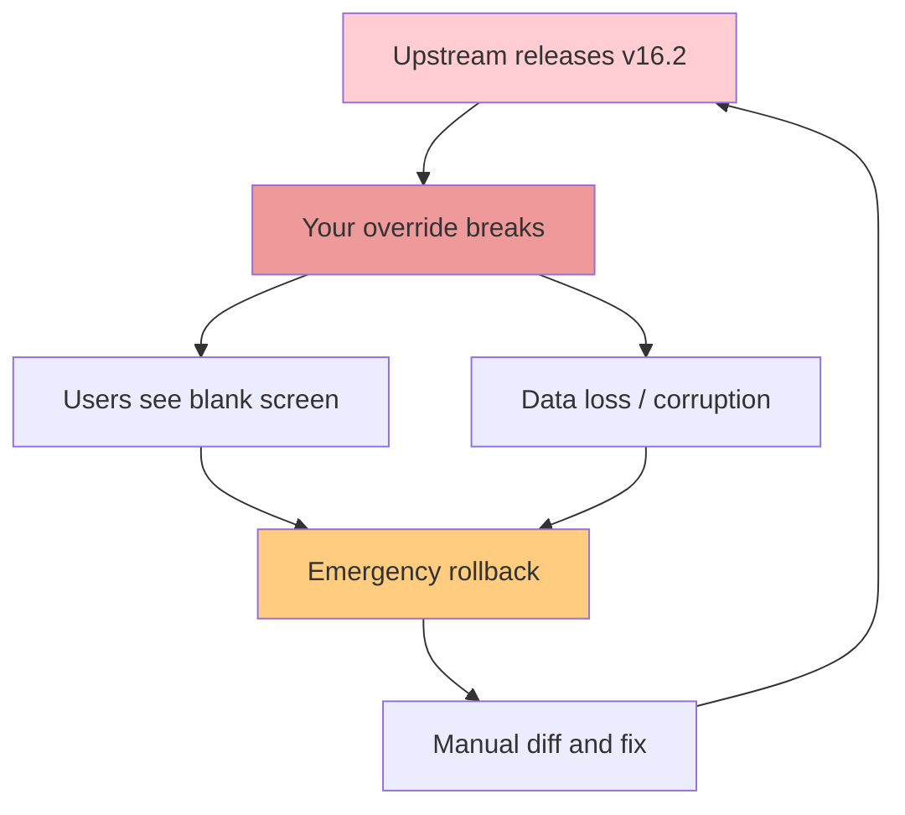
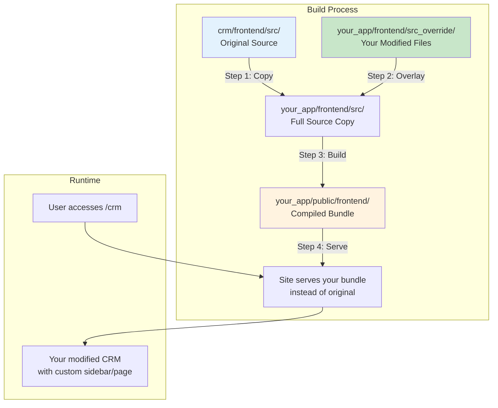
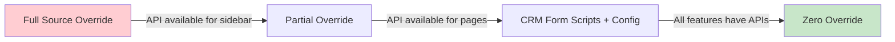

# Pattern 3: Build-Time Source Override

> The original `crm_override` technique: copy the entire source of a Frappe UI app, overlay your modified files, and build a new bundle. **Use as a last resort when no extension API exists.**

---

## Table of Contents

- [What This Pattern Does](#what-this-pattern-does)
- [When to Use This Pattern](#when-to-use-this-pattern)
- [Why We Use This Pattern (Cautiously)](#why-we-use-this-pattern-cautiously)
- [Architecture](#architecture)
- [How the Original crm_override Worked](#how-the-original-crm_override-worked)
- [Step-by-Step Guide (v16+ Compatible)](#step-by-step-guide-v16-compatible)
- [Complete Code Examples](#complete-code-examples)
- [Risk Mitigation Strategies](#risk-mitigation-strategies)
- [Version Pinning & Compatibility](#version-pinning--compatibility)
- [Troubleshooting](#troubleshooting)
- [Migration Path: Moving Away from This Pattern](#migration-path-moving-away-from-this-pattern)

---

## What This Pattern Does

This pattern physically copies the entire frontend source code of a target Frappe UI app (like CRM), replaces specific files with your customized versions, and compiles a new frontend bundle. The result is a complete replacement of the upstream app's frontend.

**The mechanism:**
1. Copy `src/` from the target app (e.g., `crm/frontend/src`) into your app's `frontend/src`
2. Copy your override files from `frontend/src_override/` on top of the copied source
3. Build the bundle using your own `vite.config.js`
4. Serve the bundle from your app's asset directory

---

## When to Use This Pattern

| Use This Pattern | Don't Use This Pattern |
|-----------------|----------------------|
| The target app has NO extension API for your need | A CRM Form Script can achieve the goal |
| You need to modify a core component's template | A Custom SPA can work alongside |
| You need to add routes to the existing router | Simple CSS overrides are sufficient |
| The upstream team confirms this is the only way | You haven't asked about upcoming APIs |

**Legitimate scenarios:**
- Adding a permanent navigation item to CRM's sidebar (when no config API exists)
- Modifying the login page layout of a Frappe UI app
- Injecting tracking/analytics into the app's root component
- Changing the app's main layout structure

---

## Why We Use This Pattern (Cautiously)

| Aspect | Assessment |
|--------|------------|
| **Power** | Complete control - you can change anything in the app's UI |
| **Fragility** | High - any upstream file you depend on may change |
| **Maintenance** | Heavy - you must track upstream changes manually |
| **Upgrade Path** | Painful - each upstream update requires testing and potential fixes |
| **Multi-tenancy** | Not safe - affects all sites |
| **Recommended?** | **No** - Only when all other patterns fail |

### Key Risks in v16+



---

## Architecture



---

## How the Original crm_override Worked

The original repository by @esafwan used this approach:

```javascript
// custom-build.js (from original repo)
const fs = require('fs-extra');
const path = require('path');
const { execSync } = require('child_process');

const crmAppPath = path.resolve(__dirname, '../../crm/frontend');
const overrideSrcPath = path.resolve(__dirname, './src');
const overrideFilesPath = path.resolve(__dirname, './src_override');

// Step 1: Copy original CRM source
console.log('Starting  :  Copying original src.');
fs.copySync(path.join(crmAppPath, 'src'), overrideSrcPath);
console.log('Completed :  Copying original src.');

// Step 2: Overlay custom files
console.log('Starting  :  Overriding src.');
fs.copySync(overrideFilesPath, overrideSrcPath);
console.log('Completed :  Overriding src.');

// Step 3: Install dependencies from CRM
execSync('yarn install', { stdio: 'inherit' });
```

**What was overridden:**
- `src_override/components/Layouts/AppSidebar.vue` - Added "Video" link to sidebar
- `src_override/pages/Video.vue` - New page with YouTube embed
- `src_override/router.js` - Added `/video` route

---

## Step-by-Step Guide (v16+ Compatible)

### Step 1: Understand the Target App Structure

```bash
# Examine the target app's frontend structure
ls apps/crm/frontend/src/
# Typical structure:
# - components/     (Vue components)
# - pages/          (Page-level components)
# - stores/         (Pinia stores)
# - router.js       (Route definitions)
# - main.js         (App entry point)
# - App.vue         (Root component)
```

### Step 2: Create Your Custom App

```bash
cd ~/frappe-bench
bench new-app my_crm_customization
bench --site dev.localhost install-app my_crm_customization
```

### Step 3: Set Up the Frontend Directory

```bash
cd apps/my_crm_customization
mkdir -p frontend
```

### Step 4: Create the Build Script

```javascript
// frontend/custom-build.js
const fs = require('fs-extra');
const path = require('path');
const { execSync } = require('child_process');

// Configuration
const TARGET_APP = 'crm';  // The app you're overriding
const TARGET_APP_PATH = path.resolve(__dirname, `../../${TARGET_APP}/frontend`);
const WORKING_SRC = path.resolve(__dirname, './src');
const OVERRIDE_DIR = path.resolve(__dirname, './src_override');

/**
 * Build-time source override for Frappe UI apps
 * 
 * WARNING: This is a high-maintenance approach. Use only when
 * no extension API is available in the target app.
 */

async function build() {
    console.log('========================================');
    console.log('Build-Time Source Override');
    console.log(`Target: ${TARGET_APP}`);
    console.log(`Source: ${TARGET_APP_PATH}`);
    console.log('========================================\n');

    // Validate target exists
    if (!fs.existsSync(TARGET_APP_PATH)) {
        console.error(`ERROR: Target app not found at ${TARGET_APP_PATH}`);
        console.error('Make sure the target app is installed in your bench.');
        process.exit(1);
    }

    // Step 1: Clean and copy original source
    console.log('[1/4] Cleaning working directory...');
    fs.removeSync(WORKING_SRC);
    
    console.log('[2/4] Copying original source from target app...');
    fs.copySync(path.join(TARGET_APP_PATH, 'src'), WORKING_SRC);
    
    // Step 3: Apply overrides
    console.log('[3/4] Applying custom overrides...');
    if (fs.existsSync(OVERRIDE_DIR)) {
        fs.copySync(OVERRIDE_DIR, WORKING_SRC, { overwrite: true });
        
        // Log overridden files
        const overriddenFiles = getOverriddenFiles(OVERRIDE_DIR);
        console.log(`       Overridden files (${overriddenFiles.length}):`);
        overriddenFiles.forEach(f => console.log(`       - ${f}`));
    } else {
        console.log('       No override directory found. Building original.');
    }

    // Step 4: Copy package.json and install dependencies
    console.log('[4/4] Installing dependencies...');
    const targetPackageJson = path.join(TARGET_APP_PATH, 'package.json');
    const ourPackageJson = path.join(__dirname, 'package.json');
    
    if (fs.existsSync(targetPackageJson)) {
        // Merge target deps with our custom deps
        const targetPkg = JSON.parse(fs.readFileSync(targetPackageJson, 'utf8'));
        const ourPkg = fs.existsSync(ourPackageJson) 
            ? JSON.parse(fs.readFileSync(ourPackageJson, 'utf8')) 
            : {};
        
        const mergedPkg = {
            ...targetPkg,
            ...ourPkg,
            dependencies: { ...targetPkg.dependencies, ...ourPkg.dependencies },
            devDependencies: { ...targetPkg.devDependencies, ...ourPkg.devDependencies }
        };
        
        fs.writeFileSync(
            path.join(__dirname, 'package.json'),
            JSON.stringify(mergedPkg, null, 2)
        );
    }
    
    execSync('yarn install', { stdio: 'inherit', cwd: __dirname });
    console.log('\n========================================');
    console.log('Pre-build complete. Ready for Vite.');
    console.log('========================================');
}

function getOverriddenFiles(dir, base = '') {
    const files = [];
    const items = fs.readdirSync(dir);
    
    for (const item of items) {
        const fullPath = path.join(dir, item);
        const relativePath = path.join(base, item);
        
        if (fs.statSync(fullPath).isDirectory()) {
            files.push(...getOverriddenFiles(fullPath, relativePath));
        } else {
            files.push(relativePath);
        }
    }
    
    return files;
}

build().catch(err => {
    console.error('Build failed:', err);
    process.exit(1);
});
```

### Step 5: Configure Vite

```javascript
// frontend/vite.config.js
import { defineConfig } from 'vite'
import vue from '@vitejs/plugin-vue'
import vueJsx from '@vitejs/plugin-vue-jsx'
import path from 'path'
import frappeui from 'frappe-ui/vite'
import { VitePWA } from 'vite-plugin-pwa'

export default defineConfig({
    plugins: [
        frappeui(),
        vue({
            script: {
                propsDestructure: true,
            },
        }),
        vueJsx(),
        // Only include PWA if the original app uses it
        VitePWA({
            registerType: 'autoUpdate',
            manifest: {
                display: 'standalone',
                name: 'Custom CRM',
                short_name: 'CRM',
                start_url: '/crm',
            },
        }),
        {
            name: 'transform-index.html',
            transformIndexHtml(html, context) {
                if (!context.server) {
                    // Production: inject Frappe context
                    return html.replace(
                        '</head>',
                        `<script>window.frappe = {}; window._version = "{{ _version }}";</script>\n</head>`
                    );
                }
                return html;
            }
        }
    ],
    resolve: {
        alias: {
            '@': path.resolve(__dirname, 'src'),
            'frappe-ui': 'frappe-ui',
        },
    },
    build: {
        outDir: path.resolve(__dirname, '../my_crm_customization/public/frontend'),
        emptyOutDir: true,
        sourcemap: true,
        rollupOptions: {
            output: {
                manualChunks(id) {
                    // Optimize chunk splitting
                    if (id.includes('node_modules')) {
                        if (id.includes('vue')) return 'vue';
                        if (id.includes('frappe-ui')) return 'frappe-ui';
                        return 'vendor';
                    }
                }
            }
        }
    },
    server: {
        port: 8080,
        proxy: {
            '^/(api|assets|files|private|socket.io)': {
                target: 'http://dev.localhost:8000',
                changeOrigin: true,
                ws: true,
            }
        }
    },
});
```

### Step 6: Configure package.json

```json
{
    "name": "my-crm-customization",
    "private": true,
    "version": "0.0.1",
    "scripts": {
        "prebuild": "node ./custom-build.js",
        "dev": "yarn prebuild && vite",
        "build": "yarn prebuild && vite build --base=/assets/my_crm_customization/frontend/ && yarn copy-html-entry",
        "copy-html-entry": "cp ../my_crm_customization/public/frontend/index.html ../my_crm_customization/www/crm.html",
        "serve": "vite preview"
    },
    "dependencies": {
        "fs-extra": "^11.1.0"
    },
    "devDependencies": {
        "vite": "^5.0.0",
        "fs-extra": "^11.1.0"
    }
}
```

### Step 7: Create Override Files

```vue
<!-- frontend/src_override/components/Layouts/AppSidebar.vue -->
<!-- 
    FULL COPY of the original AppSidebar.vue from CRM,
    with the following additions:
    
    1. Import VideoIcon
    2. Add "Video" navigation item in the views array
    3. Everything else stays EXACTLY the same
-->

<template>
    <!-- Original template content preserved -->
    <div class="relative flex h-full flex-col justify-between transition-all duration-300 ease-in-out"
         :class="isSidebarCollapsed ? 'w-12' : 'w-[220px]'">
        <!-- ... rest of original template ... -->
        
        <!-- Your custom navigation section -->
        <div class="mb-3 flex flex-col">
            <SidebarLink
                label="Video"
                :icon="VideoIcon"
                :isCollapsed="isSidebarCollapsed"
                to="/video"
                class="mx-2 my-0.5"
            />
        </div>
        
        <!-- ... rest of original template ... -->
    </div>
</template>

<script setup>
// ... all original imports preserved ...
import VideoIcon from '@/components/Icons/VideoIcon.vue'  // Your new icon

// ... all original setup code preserved ...

// Add "Video" to the views array
const views = [
    // ... original views ...
    {
        name: 'Video',
        to: '/video',
        icon: VideoIcon,
    }
]
</script>
```

```vue
<!-- frontend/src_override/pages/Video.vue -->
<!-- A completely new page component -->
<template>
    <div class="flex h-full flex-col">
        <header class="border-b px-6 py-4">
            <h1 class="text-xl font-semibold">Video Resources</h1>
            <p class="text-sm text-gray-500">Training and tutorial videos</p>
        </header>
        
        <div class="flex-1 overflow-auto p-6">
            <div class="grid grid-cols-1 lg:grid-cols-2 gap-6">
                <div class="aspect-video bg-gray-100 rounded-lg overflow-hidden">
                    <iframe 
                        class="w-full h-full"
                        src="https://www.youtube.com/embed/dQw4w9WgXcQ"
                        title="Tutorial Video"
                        frameborder="0"
                        allowfullscreen>
                    </iframe>
                </div>
                
                <div class="space-y-4">
                    <h2 class="font-medium">Getting Started with CRM</h2>
                    <p class="text-gray-600 text-sm">
                        Learn the basics of managing leads, deals, and customer 
                        relationships in Frappe CRM.
                    </p>
                    
                    <h3 class="font-medium mt-6">Related Resources</h3>
                    <ul class="space-y-2 text-sm text-gray-600">
                        <li class="flex items-center">
                            <FeatherIcon name="file-text" class="w-4 h-4 mr-2" />
                            CRM Documentation
                        </li>
                        <li class="flex items-center">
                            <FeatherIcon name="book" class="w-4 h-4 mr-2" />
                            Best Practices Guide
                        </li>
                    </ul>
                </div>
            </div>
        </div>
    </div>
</template>

<script setup>
import { FeatherIcon } from 'frappe-ui'
</script>
```

```javascript
// frontend/src_override/router.js
// FULL COPY of original router.js with modifications

import { createRouter, createWebHistory } from 'vue-router'
import { userResource } from '@/stores/user'
import { sessionStore } from '@/stores/session'

const routes = [
    // ... ALL ORIGINAL ROUTES PRESERVED ...
    
    // Your new route added at the end
    {
        path: '/video',
        name: 'Video',
        component: () => import('@/pages/Video.vue'),
        meta: { 
            requiresAuth: true,
            scrollPos: { top: 0, left: 0 }
        }
    },
    
    // Original fallback preserved
    {
        path: '/:pathMatch(.*)*',
        name: 'NotFound',
        component: () => import('@/pages/NotFound.vue')
    }
]

// ... rest of router configuration preserved ...

const router = createRouter({
    history: createWebHistory('/crm'),
    routes
})

export default router
```

### Step 8: Build and Install

```bash
cd apps/my_crm_customization/frontend

# Install dependencies
yarn

# Build (runs prebuild + vite build)
yarn build

# Or for development
yarn dev
```

### Step 9: Integrate with Frappe

```python
# my_crm_customization/hooks.py

# Add build command
app_include_js = "/assets/my_crm_customization/frontend/assets/index.js"

# Ensure target app is dependency
required_apps = ["crm"]

# Pin the exact version you developed against
# In pyproject.toml:
# dependencies = ["crm==1.12.0"]  # Pin exact version!
```

---

## Risk Mitigation Strategies

### 1. Document Every Override

```markdown
# OVERRIDE LOG

## File: components/Layouts/AppSidebar.vue
- **Original:** CRM v1.12.0
- **Date:** 2026-01-15
- **Author:** Jane Developer
- **Changes:**
  - Added VideoIcon import (line 45)
  - Added "Video" nav item to views array (line 112-116)
  - Added Video SidebarLink in template (lines 78-84)
- **Reason:** Customer training requirement (ticket #4521)
- **Upstream Ticket:** https://github.com/frappe/crm/issues/XXX
```

### 2. Automated Diff Checking

```bash
#!/bin/bash
# check-upstream.sh - Run after upstream updates

UPSTREAM="apps/crm/frontend/src"
OVERRIDE="apps/my_crm_customization/frontend/src_override"

echo "Checking if overridden files changed upstream..."

for file in $(find $OVERRIDE -type f); do
    rel_path="${file#$OVERRIDE/}"
    upstream_file="$UPSTREAM/$rel_path"
    
    if [ -f "$upstream_file" ]; then
        if ! diff -q "$upstream_file" "$file" > /dev/null 2>&1; then
            echo "[CHANGED] $rel_path - Review needed!"
            diff "$upstream_file" "$file" | head -50
        else
            echo "[SAME] $rel_path - No changes needed"
        fi
    else
        echo "[NEW] $rel_path - New file in override"
    fi
done
```

### 3. Visual Regression Testing

```javascript
// playwright.config.js
import { defineConfig } from '@playwright/test';

export default defineConfig({
    testDir: './tests',
    use: {
        baseURL: 'http://dev.localhost:8000',
        screenshot: 'only-on-failure'
    },
    projects: [
        { name: 'chromium', use: { browserName: 'chromium' } }
    ]
});
```

```javascript
// tests/sidebar.spec.js
import { test, expect } from '@playwright/test';

test('sidebar contains video link', async ({ page }) => {
    await page.goto('/crm');
    await page.waitForSelector('.sidebar');
    
    const videoLink = page.locator('text=Video');
    await expect(videoLink).toBeVisible();
    
    await videoLink.click();
    await expect(page).toHaveURL(/.*\/video/);
});
```

---

## Version Pinning & Compatibility

### Pin Upstream Version

```toml
# pyproject.toml
[project]
name = "my_crm_customization"
version = "0.0.1"
dependencies = [
    "frappe>=16.0.0,<17.0.0",
    "crm==1.12.0"  # Pin EXACT version
]
```

### Compatibility Matrix

| Your Override Version | CRM Version | Status |
|----------------------|-------------|--------|
| 0.0.1 | 1.12.0 | Tested OK |
| 0.0.1 | 1.13.0 | Needs review |
| 0.0.2 | 1.13.0 | Tested OK |
| 0.0.2 | 1.14.0 | Broken - AppSidebar.vue changed |

---

## Troubleshooting

### Issue: Build fails with "module not found"

**Cause:** Upstream app added new dependencies.

**Solution:**
```bash
cd frontend
rm -rf src node_modules yarn.lock
yarn prebuild  # Re-copy and re-install
yarn build
```

### Issue: Styles look wrong after upstream update

**Cause:** Upstream changed Tailwind config or CSS variables.

**Solution:**
```bash
# Diff the original styles
diff apps/crm/frontend/src/assets apps/my_crm_customization/frontend/src/assets
```

### Issue: Router doesn't work for new page

**Cause:** Upstream changed router guards or auth logic.

**Solution:** Compare your `router.js` with the latest upstream version and merge changes.

### Issue: Blank screen after build

**Checklist:**
1. Check browser console for JS errors
2. Verify all imports resolve correctly
3. Ensure `frappe-ui` version is compatible
4. Check that `copy-html-entry` ran successfully
5. Verify `ignore_csrf` is set for dev, removed for production

---

## Migration Path: Moving Away from This Pattern

If the upstream app adds an official extension API, migrate gradually:



1. **Track upstream issues** for extension API requests
2. **Contribute upstream** by submitting PRs that add slots or config options
3. **Reduce override surface** by using newer APIs as they become available
4. **Document dependencies** so future maintainers know what to check
