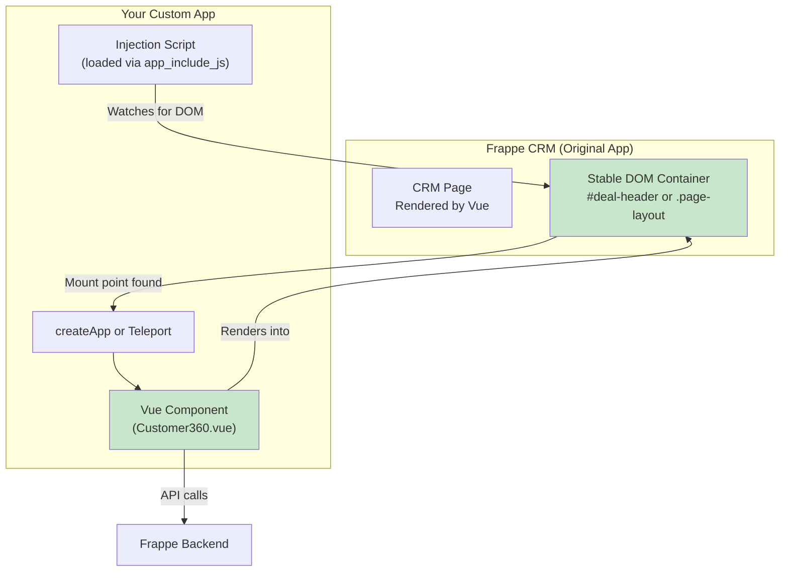

# Pattern 4: Vue Portal Injection

> Mount custom Vue components into specific DOM targets within existing Frappe UI apps. A surgical approach that doesn't require copying source code.

---

## Table of Contents

- [What This Pattern Does](#what-this-pattern-does)
- [When to Use This Pattern](#when-to-use-this-pattern)
- [Why We Use This Pattern](#why-we-use-this-pattern)
- [Architecture](#architecture)
- [How It Works](#how-it-works)
- [Step-by-Step Guide](#step-by-step-guide)
- [Complete Code Examples](#complete-code-examples)
- [Finding Injection Targets](#finding-injection-targets)
- [Limitations and Caveats](#limitations-and-caveats)

---

## What This Pattern Does

Instead of replacing the entire frontend (Pattern 3), this pattern injects your custom Vue components into specific, stable DOM locations within an existing Frappe UI app. It uses:

1. **Vue's `<Teleport>`** to render components into existing DOM elements
2. **`createApp()`** to mount independent Vue apps into container elements
3. **DOM selectors** to find stable injection points

Think of it as "surgical augmentation" rather than "full replacement."

---

## When to Use This Pattern

| Use This Pattern | Don't Use This Pattern |
|-----------------|----------------------|
| Add a widget/panel to an existing page | Modify component internal logic |
| Inject analytics/tracking UI | Change routing behavior |
| Add floating action buttons | Override form validation |
| Insert info banners or alerts | Modify sidebar structure |
| Add context-sensitive help | Change navigation patterns |

**Specific scenarios:**
- Show a "Customer 360" widget on a Deal page
- Add a floating "Quick Actions" menu in CRM
- Insert an AI assistant chat bubble
- Display real-time notifications panel
- Add custom KPI badges to record headers

---

## Why We Use This Pattern

| Advantage | Explanation |
|-----------|-------------|
| **No Source Copying** | Doesn't touch upstream source files |
| **Targeted** | Only affects specific DOM locations |
| **Lower Risk** | Much less fragile than full source override |
| **Composable** | Multiple independent injections can coexist |
| **Easy to Disable** | Remove the script and injection disappears |
| **Upgrade Resilient** | Survives most upstream UI changes |

---

## Architecture



---

## How It Works

### Method 1: createApp Injection (Recommended for Independent Widgets)

Mount a completely independent Vue app into a DOM element that you create or find:

```javascript
// Your script creates a container and mounts a Vue app into it
const container = document.createElement('div')
container.id = 'my-custom-widget'
const target = document.querySelector('.some-stable-class')
target.appendChild(container)

createApp(MyWidget).mount('#my-custom-widget')
```

### Method 2: Vue Teleport (If You're Inside the Same Vue App)

If you have control over a parent component, use `<Teleport>`:

```vue
<template>
    <div>
        <!-- Your component's local content -->
    </div>
    
    <!-- Render this into a target outside your component -->
    <Teleport to="#external-target">
        <MyWidget />
    </Teleport>
</template>
```

### Method 3: Native DOM Manipulation (For Simple Elements)

For simple HTML injections that don't need Vue reactivity:

```javascript
const banner = document.createElement('div')
banner.className = 'my-custom-banner'
banner.innerHTML = '<p>Important notice: System maintenance tonight</p>'
document.querySelector('#header').prepend(banner)
```

---

## Step-by-Step Guide

### Step 1: Identify the Injection Target

Open the target app in your browser and use DevTools to find a stable container:

```javascript
// In browser console, test selectors:
document.querySelector('.app-layout')           // Main layout
document.querySelector('.page-header')          // Page header
document.querySelector('[data-page="deal"]')    // Specific page
document.querySelector('#crm-deal-page header') // Nested selector
```

### Step 2: Create Your Custom App's Frontend Script

```bash
cd apps/my_crm_customization
mkdir -p public/js
```

### Step 3: Write the Injection Script

```javascript
// public/js/crm-injections.js
/**
 * CRM Component Injection System
 * 
 * Injects custom widgets into specific DOM locations within Frappe CRM.
 * Uses MutationObserver to handle SPA navigation (no page reloads).
 */

import { createApp, ref, computed, onMounted, onUnmounted } from 'vue'
import { FrappeUI, frappeRequest, FeatherIcon, Badge } from 'frappe-ui'
import './crm-injections.css'

// ======== CONFIGURATION ========
const INJECTIONS = [
    {
        id: 'customer-360-widget',
        name: 'Customer 360 Widget',
        // Only inject on deal pages
        routePattern: /\/deals\//,
        // Wait for this selector to appear
        targetSelector: '.deal-header, [data-doctype="CRM Deal"] .header',
        // Where to insert relative to target
        position: 'afterend', // 'beforebegin' | 'afterbegin' | 'beforeend' | 'afterend'
        component: Customer360Widget
    },
    {
        id: 'quick-actions-fab',
        name: 'Quick Actions FAB',
        routePattern: /\/leads\/|\/deals\//,
        targetSelector: '.app-layout',
        position: 'beforeend',
        component: QuickActionsFAB
    }
]

// ======== WIDGET COMPONENTS ========

const Customer360Widget = {
    template: `
        <div class="customer-360-widget" v-if="customer">
            <div class="widget-header">
                <FeatherIcon name="user" class="w-4 h-4" />
                <span class="font-medium">Customer 360</span>
                <Badge :label="customerTier" :variant="tierVariant" />
            </div>
            <div class="widget-body">
                <div class="metric">
                    <span class="label">Lifetime Value</span>
                    <span class="value">{{ formatCurrency(lifetimeValue) }}</span>
                </div>
                <div class="metric">
                    <span class="label">Total Orders</span>
                    <span class="value">{{ totalOrders }}</span>
                </div>
                <div class="metric">
                    <span class="label">Last Contact</span>
                    <span class="value">{{ lastContactDate }}</span>
                </div>
            </div>
            <div class="widget-actions">
                <button @click="viewCustomer" class="action-btn">
                    View Profile
                </button>
                <button @click="sendEmail" class="action-btn">
                    Send Email
                </button>
            </div>
        </div>
    `,
    components: { FeatherIcon, Badge },
    setup() {
        const customer = ref(null)
        const lifetimeValue = ref(0)
        const totalOrders = ref(0)
        const lastContactDate = ref('')
        
        // Extract customer from the page's data
        // This depends on how CRM exposes data - may need adjustment
        const customerTier = computed(() => {
            if (lifetimeValue.value > 100000) return 'Enterprise'
            if (lifetimeValue.value > 25000) return 'Premium'
            return 'Standard'
        })
        
        const tierVariant = computed(() => {
            if (customerTier.value === 'Enterprise') return 'solid'
            if (customerTier.value === 'Premium') return 'subtle'
            return 'outline'
        })
        
        onMounted(async () => {
            // Try to extract customer name from the Vue app or DOM
            const customerName = extractCustomerFromPage()
            if (customerName) {
                await loadCustomerData(customerName)
            }
        })
        
        async function loadCustomerData(name) {
            try {
                const data = await frappeRequest({
                    url: '/api/resource/Customer',
                    method: 'GET',
                    params: { name }
                })
                customer.value = data
                // Load additional metrics
                const metrics = await frappeRequest({
                    url: 'my_crm_customization.api.get_customer_metrics',
                    body: { customer: name }
                })
                lifetimeValue.value = metrics.lifetime_value
                totalOrders.value = metrics.total_orders
                lastContactDate.value = metrics.last_contact
            } catch (e) {
                console.error('Failed to load customer data:', e)
            }
        }
        
        function extractCustomerFromPage() {
            // Method 1: Try to find in DOM
            const el = document.querySelector('[data-fieldname="customer"] .value')
            if (el) return el.textContent.trim()
            
            // Method 2: Try to access CRM's Vue app data
            const vueEl = document.querySelector('#app')
            if (vueEl?.__vue_app__) {
                // Navigate through component tree (fragile!)
                const app = vueEl.__vue_app__
                // Access router or store
                const currentRoute = app.config.globalProperties.$router?.currentRoute?.value
                return currentRoute?.params?.dealId
            }
            
            // Method 3: Parse from URL
            const match = window.location.pathname.match(/\/deals\/([^\/]+)/)
            if (match) {
                // Fetch deal to get customer
                return null // Will need async lookup
            }
            
            return null
        }
        
        function formatCurrency(value) {
            return new Intl.NumberFormat('en-US', {
                style: 'currency',
                currency: 'USD'
            }).format(value || 0)
        }
        
        function viewCustomer() {
            window.open(`/app/customer/${customer.value?.name}`, '_blank')
        }
        
        function sendEmail() {
            window.location.href = `mailto:${customer.value?.email_id}`
        }
        
        return {
            customer,
            lifetimeValue,
            totalOrders,
            lastContactDate,
            customerTier,
            tierVariant,
            formatCurrency,
            viewCustomer,
            sendEmail
        }
    }
}

const QuickActionsFAB = {
    template: `
        <div class="quick-actions-fab">
            <button 
                class="fab-main"
                @click="isOpen = !isOpen"
                :class="{ open: isOpen }"
            >
                <FeatherIcon :name="isOpen ? 'x' : 'plus'" class="w-6 h-6" />
            </button>
            <div class="fab-actions" :class="{ open: isOpen }">
                <button @click="logCall" class="fab-action" title="Log Call">
                    <FeatherIcon name="phone" class="w-5 h-5" />
                </button>
                <button @click="scheduleTask" class="fab-action" title="Schedule Task">
                    <FeatherIcon name="calendar" class="w-5 h-5" />
                </button>
                <button @click="sendEmail" class="fab-action" title="Send Email">
                    <FeatherIcon name="mail" class="w-5 h-5" />
                </button>
            </div>
        </div>
    `,
    components: { FeatherIcon },
    setup() {
        const isOpen = ref(false)
        
        function logCall() {
            createDialog({
                title: 'Log Call',
                fields: [
                    { label: 'Call Type', fieldname: 'type', fieldtype: 'Select', options: ['Inbound', 'Outbound'] },
                    { label: 'Notes', fieldname: 'notes', fieldtype: 'Text' }
                ],
                primary_action: async (values) => {
                    await frappeRequest({
                        url: 'my_crm_customization.api.log_call',
                        body: { ...values, deal: getCurrentDeal() }
                    })
                    toast.success('Call logged')
                }
            })
            isOpen.value = false
        }
        
        function scheduleTask() {
            // Implementation
            isOpen.value = false
        }
        
        function sendEmail() {
            // Implementation
            isOpen.value = false
        }
        
        function getCurrentDeal() {
            const match = window.location.pathname.match(/\/deals\/([^\/]+)/)
            return match ? match[1] : null
        }
        
        return { isOpen, logCall, scheduleTask, sendEmail }
    }
}

// ======== INJECTION ENGINE ========

class InjectionManager {
    constructor() {
        this.instances = new Map()
        this.observer = null
        this.currentRoute = window.location.pathname
    }
    
    start() {
        // Watch for SPA navigation (URL changes without page reload)
        this.setupRouteWatcher()
        
        // Initial injection
        this.checkAndInject()
    }
    
    setupRouteWatcher() {
        // Override history methods to detect navigation
        const originalPushState = history.pushState
        const originalReplaceState = history.replaceState
        const manager = this
        
        history.pushState = function(...args) {
            originalPushState.apply(this, args)
            manager.onRouteChange()
        }
        
        history.replaceState = function(...args) {
            originalReplaceState.apply(this, args)
            manager.onRouteChange()
        }
        
        window.addEventListener('popstate', () => this.onRouteChange())
    }
    
    onRouteChange() {
        const newRoute = window.location.pathname
        if (newRoute !== this.currentRoute) {
            this.currentRoute = newRoute
            // Clean up injections from previous page
            this.cleanup()
            // Wait for new page to render
            setTimeout(() => this.checkAndInject(), 500)
        }
    }
    
    checkAndInject() {
        INJECTIONS.forEach(config => {
            // Check if current route matches
            if (!config.routePattern.test(this.currentRoute)) return
            
            // Check if target element exists
            const target = document.querySelector(config.targetSelector)
            if (!target) {
                // Try again later - page might still be loading
                setTimeout(() => this.checkAndInject(), 300)
                return
            }
            
            // Check if already injected
            if (this.instances.has(config.id)) return
            
            // Create container
            const container = document.createElement('div')
            container.id = config.id
            container.className = `injection-${config.id}`
            
            // Insert into DOM
            if (config.position === 'afterend' || config.position === 'beforebegin') {
                target.insertAdjacentElement(config.position, container)
            } else {
                if (config.position === 'afterbegin') {
                    target.prepend(container)
                } else {
                    target.append(container)
                }
            }
            
            // Mount Vue app
            const app = createApp(config.component)
            app.use(FrappeUI)
            app.mount(container)
            
            this.instances.set(config.id, { app, container, config })
            console.log(`[InjectionManager] Injected: ${config.name}`)
        })
    }
    
    cleanup() {
        this.instances.forEach(({ app, container }, id) => {
            app.unmount()
            container.remove()
            console.log(`[InjectionManager] Cleaned up: ${id}`)
        })
        this.instances.clear()
    }
    
    stop() {
        this.cleanup()
    }
}

// ======== INITIALIZATION ========

// Wait for DOM to be ready
if (document.readyState === 'loading') {
    document.addEventListener('DOMContentLoaded', init)
} else {
    init()
}

function init() {
    // Only initialize on CRM pages
    if (!window.location.pathname.startsWith('/crm')) return
    
    const manager = new InjectionManager()
    manager.start()
    
    // Expose for debugging
    window.__injectionManager = manager
    console.log('[CRM Injection] System initialized')
}
```

```css
/* public/js/crm-injections.css */
.customer-360-widget {
    background: white;
    border: 1px solid #e5e7eb;
    border-radius: 8px;
    padding: 16px;
    margin: 8px 0;
    box-shadow: 0 1px 3px rgba(0,0,0,0.1);
}

.widget-header {
    display: flex;
    align-items: center;
    gap: 8px;
    margin-bottom: 12px;
    padding-bottom: 8px;
    border-bottom: 1px solid #f3f4f6;
}

.widget-body {
    display: grid;
    grid-template-columns: repeat(3, 1fr);
    gap: 12px;
    margin-bottom: 12px;
}

.metric {
    display: flex;
    flex-direction: column;
}

.metric .label {
    font-size: 12px;
    color: #6b7280;
}

.metric .value {
    font-size: 14px;
    font-weight: 600;
    color: #111827;
}

.widget-actions {
    display: flex;
    gap: 8px;
}

.action-btn {
    padding: 6px 12px;
    border: 1px solid #d1d5db;
    border-radius: 6px;
    background: white;
    font-size: 13px;
    cursor: pointer;
    transition: all 0.2s;
}

.action-btn:hover {
    background: #f9fafb;
    border-color: #9ca3af;
}

/* Quick Actions FAB */
.quick-actions-fab {
    position: fixed;
    bottom: 24px;
    right: 24px;
    z-index: 1000;
}

.fab-main {
    width: 56px;
    height: 56px;
    border-radius: 50%;
    background: #1f2937;
    color: white;
    border: none;
    cursor: pointer;
    display: flex;
    align-items: center;
    justify-content: center;
    box-shadow: 0 4px 12px rgba(0,0,0,0.3);
    transition: transform 0.3s, background 0.3s;
}

.fab-main:hover {
    background: #374151;
}

.fab-main.open {
    transform: rotate(45deg);
}

.fab-actions {
    position: absolute;
    bottom: 64px;
    right: 4px;
    display: flex;
    flex-direction: column;
    gap: 8px;
    opacity: 0;
    transform: translateY(10px);
    pointer-events: none;
    transition: all 0.3s;
}

.fab-actions.open {
    opacity: 1;
    transform: translateY(0);
    pointer-events: auto;
}

.fab-action {
    width: 48px;
    height: 48px;
    border-radius: 50%;
    background: white;
    border: 1px solid #e5e7eb;
    cursor: pointer;
    display: flex;
    align-items: center;
    justify-content: center;
    box-shadow: 0 2px 8px rgba(0,0,0,0.15);
    transition: all 0.2s;
}

.fab-action:hover {
    background: #f3f4f6;
    transform: scale(1.1);
}
```

### Step 4: Register in hooks.py

```python
# my_crm_customization/hooks.py

# Include the injection script in CRM pages
app_include_js = "/assets/my_crm_customization/js/crm-injections.js"
app_include_css = "/assets/my_crm_customization/css/crm-injections.css"
```

### Step 5: Bundle with Vite

```javascript
// frontend/vite.inject.config.js
import { defineConfig } from 'vite'
import vue from '@vitejs/plugin-vue'
import path from 'path'

export default defineConfig({
    plugins: [vue()],
    build: {
        lib: {
            entry: path.resolve(__dirname, '../public/js/crm-injections.js'),
            name: 'CRMInjections',
            fileName: 'crm-injections',
            formats: ['iife']
        },
        rollupOptions: {
            external: [],
            output: {
                // Bundle Vue and FrappeUI inline
                inlineDynamicImports: true
            }
        },
        outDir: '../public/js/dist'
    }
})
```

---

## Complete Code Examples

### Example: Page-Specific Header Badge

```javascript
// Inject a badge showing deal priority into CRM deal pages
function injectPriorityBadge() {
    const observer = new MutationObserver((mutations) => {
        const header = document.querySelector('.deal-header h1, [data-doctype="CRM Deal"] h1')
        if (header && !header.querySelector('.priority-badge')) {
            const dealId = extractDealId()
            if (dealId) {
                fetchPriority(dealId).then(priority => {
                    const badge = document.createElement('span')
                    badge.className = `priority-badge badge badge-${priority.toLowerCase()}`
                    badge.textContent = priority
                    header.appendChild(badge)
                })
            }
        }
    })
    
    observer.observe(document.body, { childList: true, subtree: true })
    
    // Cleanup on navigation
    window.addEventListener('beforeunload', () => observer.disconnect())
}

async function fetchPriority(dealId) {
    const result = await frappe.db.get_value('CRM Deal', dealId, 'priority')
    return result.message?.priority || 'Medium'
}
```

### Example: Context-Aware Help Panel

```javascript
// Show help content based on the current page
class ContextHelpPanel {
    constructor() {
        this.panel = null
        this.currentPage = null
    }
    
    init() {
        this.createPanel()
        this.watchRoute()
    }
    
    createPanel() {
        this.panel = document.createElement('div')
        this.panel.className = 'context-help-panel collapsed'
        this.panel.innerHTML = `
            <div class="help-toggle">
                <span>?</span>
            </div>
            <div class="help-content">
                <h3>Help</h3>
                <div id="help-body">Loading...</div>
            </div>
        `
        
        this.panel.querySelector('.help-toggle').addEventListener('click', () => {
            this.panel.classList.toggle('collapsed')
        })
        
        document.body.appendChild(this.panel)
    }
    
    watchRoute() {
        const check = () => {
            const path = window.location.pathname
            if (path !== this.currentPage) {
                this.currentPage = path
                this.updateContent(path)
            }
        }
        
        setInterval(check, 500)
    }
    
    updateContent(path) {
        const helpBody = this.panel.querySelector('#help-body')
        
        if (path.includes('/deals/')) {
            helpBody.innerHTML = `
                <p><strong>Managing Deals</strong></p>
                <ul>
                    <li>Update status as deal progresses</li>
                    <li>Add contacts to track stakeholders</li>
                    <li>Log all interactions in the timeline</li>
                </ul>
            `
        } else if (path.includes('/leads/')) {
            helpBody.innerHTML = `
                <p><strong>Working with Leads</strong></p>
                <ul>
                    <li>Qualify leads within 24 hours</li>
                    <li>Update source for tracking</li>
                    <li>Convert qualified leads to deals</li>
                </ul>
            `
        } else {
            helpBody.innerHTML = '<p>Select a record to see contextual help.</p>'
        }
    }
}
```

---

## Finding Injection Targets

### DOM Exploration Strategy

```javascript
// Bookmarklet for finding stable selectors
javascript:(function(){
    const elements = document.querySelectorAll('[id], [class]')
    const results = []
    elements.forEach(el => {
        if (el.id) results.push(`#${el.id}`)
        const classes = Array.from(el.classList).filter(c => c.length > 3)
        classes.forEach(c => results.push(`.${c}`))
    })
    console.log('Potential selectors:', [...new Set(results)])
    
    // Highlight elements with IDs
    document.querySelectorAll('[id]').forEach(el => {
        el.style.outline = '2px solid red'
        el.title = `#${el.id}`
    })
})()
```

### Stable vs. Fragile Selectors

| Stable (Use These) | Fragile (Avoid These) |
|-------------------|----------------------|
| `[id]` attributes | Auto-generated classes (`.sc-1a2b3c`) |
| Semantic classes (`.deal-header`) | Position-based (`:nth-child(3)`) |
| `data-*` attributes (`data-doctype`) | Deep nesting (`div > div > span`) |
| Component classes (`.app-layout`) | Dynamic classes (`.active-20260115`) |

---

## Limitations and Caveats

1. **SPA Navigation**: The target app is a Vue SPA, so you must watch for route changes. Standard page load events won't fire.

2. **Timing**: Your script may run before the target app renders. Use `MutationObserver` or polling to wait for elements.

3. **Vue Version Mismatch**: If you mount a Vue 3 app inside another Vue 3 app, ensure versions are compatible.

4. **CSS Scoping**: Your styles may conflict. Use specific class names and consider CSS scoping.

5. **No Official API**: This is still a workaround, just a more targeted one than Pattern 3.

6. **Performance**: Excessive MutationObservers can slow down the page. Disconnect when not needed.
