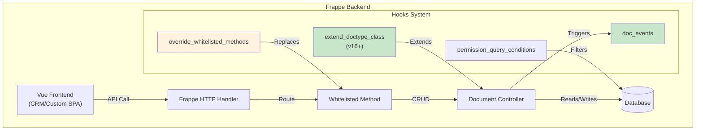
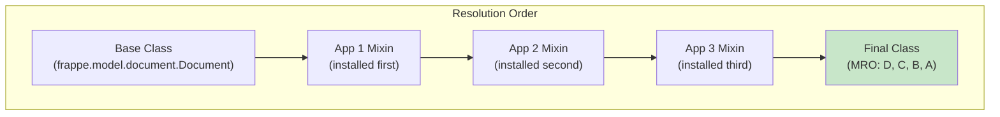

# Pattern 5: Server-Side Extension Hooks

> Extend Frappe's backend behavior using Python hooks. While not directly a UI pattern, server-side extensions are essential companions to any frontend customization.

---

## Table of Contents

- [What This Pattern Does](#what-this-pattern-does)
- [When to Use This Pattern](#when-to-use-this-pattern)
- [Why We Use This Pattern](#why-we-use-this-pattern)
- [Architecture](#architecture)
- [Available Hooks in v16+](#available-hooks-in-v16)
- [Complete Code Examples](#complete-code-examples)
- [Hook Priority and Resolution Order](#hook-priority-and-resolution-order)
- [Testing and Debugging](#testing-and-debugging)
- [Common Anti-Patterns](#common-anti-patterns)

---

## What This Pattern Does

Frappe's hooks system allows your custom app to inject Python code into the framework's execution flow without modifying core files. In v16+, new hooks like `extend_doctype_class` enable safer, more maintainable extensions.

**Key capabilities:**
- Run code on document lifecycle events (create, update, delete, submit)
- Add methods to existing DocType classes
- Override whitelisted API methods
- Modify queries and permissions
- Schedule background jobs

---

## When to Use This Pattern

| Use This Pattern | Don't Use This Pattern |
|-----------------|----------------------|
| Field validation and business rules | Purely cosmetic changes |
| Auto-populating calculated fields | Simple form UI tweaks |
| Cross-document consistency checks | Button placement |
| Custom API endpoints for frontend | Client-side formatting |
| Background processing | Anything visual |

**Always use server-side hooks when:**
- Data integrity is at stake
- Multiple users might conflict
- Security/permissions matter
- External integrations are involved

---

## Why We Use This Pattern

| Advantage | Explanation |
|-----------|-------------|
| **Data Integrity** | Validation runs server-side, can't be bypassed |
| **Security** | Business logic isn't exposed to client manipulation |
| **Reliability** | Survives all frontend changes |
| **Multi-tenancy** | Each site gets its own configuration |
| **Performance** | Heavy processing runs on server, not client |
| **Transaction Safety** | Database transactions ensure consistency |

---

## Architecture



---

## Available Hooks in v16+

### 1. `extend_doctype_class` (v16+ - Preferred)

Add methods and properties to existing DocType classes without replacing them.

```python
# hooks.py
extend_doctype_class = {
    "Sales Invoice": [
        "my_app.extensions.sales_invoice.SalesInvoiceMixin"
    ],
    "Customer": [
        "my_app.extensions.customer.CustomerMixin",
        "my_app.extensions.common.AuditMixin"  # Multiple mixins
    ]
}
```

### 2. `override_doctype_class` (Legacy - Use Sparingly)

Completely replace a DocType class. Risky when multiple apps override the same DocType.

```python
# hooks.py
override_doctype_class = {
    "ToDo": "my_app.overrides.custom_todo.CustomToDo"
}
```

### 3. `doc_events`

Run code on document lifecycle events.

```python
# hooks.py
doc_events = {
    "Sales Order": {
        "on_submit": "my_app.sales_order.on_submit",
        "on_cancel": "my_app.sales_order.on_cancel",
        "validate": "my_app.sales_order.validate"
    },
    "*": {  # All doctypes
        "after_insert": "my_app.audit.log_creation"
    }
}
```

### 4. `override_whitelisted_methods`

Replace a whitelisted method with your own implementation.

```python
# hooks.py
override_whitelisted_methods = {
    "frappe.client.get_list": "my_app.overrides.custom_get_list",
    "erpnext.selling.doctype.sales_order.sales_order.make_sales_invoice": 
        "my_app.sales_order.custom_make_invoice"
}
```

### 5. `permission_query_conditions`

Modify list queries based on user permissions.

```python
# hooks.py
permission_query_conditions = {
    "Sales Order": "my_app.permissions.sales_order_query"
}
```

---

## Complete Code Examples

### Example 1: extend_doctype_class - Credit Limit Check

```python
# my_app/extensions/sales_invoice.py
import frappe
from frappe import _

class SalesInvoiceMixin:
    """Add credit limit validation to Sales Invoice."""
    
    def before_validate(self):
        """Called before standard validation."""
        self._check_credit_limit()
    
    def _check_credit_limit(self):
        """Ensure invoice total doesn't exceed customer's credit limit."""
        if not self.customer:
            return
            
        customer = frappe.get_doc("Customer", self.customer)
        credit_limit = customer.credit_limit or 0
        
        if credit_limit <= 0:
            return  # No limit set
        
        # Calculate outstanding amount
        outstanding = frappe.db.sql("""
            SELECT SUM(outstanding_amount)
            FROM `tabSales Invoice`
            WHERE customer = %s
            AND docstatus = 1
            AND name != %s
        """, (self.customer, self.name or ""))[0][0] or 0
        
        total_with_this = outstanding + self.grand_total
        
        if total_with_this > credit_limit:
            frappe.throw(
                _("""Credit limit exceeded for {customer}.
                
Limit: {limit}
Outstanding: {outstanding}
This invoice: {current}
Total: {total}

Please request a credit limit increase or reduce the invoice amount.""").format(
                    customer=self.customer,
                    limit=frappe.format_value(credit_limit, {"fieldtype": "Currency"}),
                    outstanding=frappe.format_value(outstanding, {"fieldtype": "Currency"}),
                    current=frappe.format_value(self.grand_total, {"fieldtype": "Currency"}),
                    total=frappe.format_value(total_with_this, {"fieldtype": "Currency"})
                ),
                title=_("Credit Limit Exceeded")
            )
    
    @property
    def customer_outstanding(self):
        """Virtual field: Total outstanding for this customer."""
        return frappe.db.sql("""
            SELECT SUM(outstanding_amount)
            FROM `tabSales Invoice`
            WHERE customer = %s AND docstatus = 1
        """, self.customer)[0][0] or 0
```

```python
# hooks.py
extend_doctype_class = {
    "Sales Invoice": ["my_app.extensions.sales_invoice.SalesInvoiceMixin"]
}
```

### Example 2: extend_doctype_class - Multiple Mixins

```python
# my_app/extensions/common.py
import frappe
from frappe.utils import now

class AuditMixin:
    """Add audit fields to any DocType."""
    
    def before_save(self):
        if not self.is_new():
            self.previous_values = frappe.db.get_value(
                self.doctype, self.name, "*", as_dict=True
            )
    
    def on_update(self):
        self._log_changes()
    
    def _log_changes(self):
        if not hasattr(self, 'previous_values'):
            return
            
        for field, old_value in self.previous_values.items():
            new_value = self.get(field)
            if old_value != new_value:
                frappe.get_doc({
                    "doctype": "Audit Log",
                    "reference_doctype": self.doctype,
                    "reference_name": self.name,
                    "field": field,
                    "old_value": str(old_value)[:140],
                    "new_value": str(new_value)[:140],
                    "modified_by": frappe.session.user,
                    "modified": now()
                }).insert(ignore_permissions=True)
```

```python
# my_app/extensions/customer.py
from my_app.extensions.common import AuditMixin

class CustomerMixin(AuditMixin):
    """Customer-specific extensions."""
    
    @property
    def lifetime_value(self):
        """Calculate total lifetime value across all invoices."""
        return frappe.db.sql("""
            SELECT SUM(grand_total)
            FROM `tabSales Invoice`
            WHERE customer = %s AND docstatus = 1
        """, self.name)[0][0] or 0
    
    @property
    def active_deals(self):
        """Count of active CRM deals for this customer."""
        if not frappe.db.exists("DocType", "CRM Deal"):
            return 0
        return frappe.db.count("CRM Deal", {
            "customer": self.name,
            "status": ["not in", ["Won", "Lost", "Closed"]]
        })
```

```python
# hooks.py - Multiple mixins applied
extend_doctype_class = {
    "Customer": [
        "my_app.extensions.customer.CustomerMixin",
        "my_app.extensions.common.AuditMixin"
    ],
    "Supplier": [
        "my_app.extensions.common.AuditMixin"
    ]
}
```

### Example 3: doc_events - Document Lifecycle

```python
# my_app/sales_order.py
import frappe
from frappe import _

def on_submit(doc, method):
    """Called when Sales Order is submitted."""
    
    # Create a project for large orders
    if doc.grand_total > 50000:
        create_project_from_order(doc)
    
    # Notify sales team
    notify_team(doc, "submitted")
    
    # Reserve inventory if enabled
    if frappe.db.get_single_value("Selling Settings", "reserve_stock"):
        reserve_stock(doc)

def on_cancel(doc, method):
    """Called when Sales Order is cancelled."""
    
    # Release reserved stock
    release_stock_reservation(doc)
    
    # Notify team
    notify_team(doc, "cancelled")
    
    # Log cancellation reason if provided
    if doc.cancellation_reason:
        frappe.get_doc({
            "doctype": "Comment",
            "comment_type": "Info",
            "reference_doctype": "Sales Order",
            "reference_name": doc.name,
            "content": f"Cancelled: {doc.cancellation_reason}"
        }).insert()

def validate(doc, method):
    """Validation that runs before save."""
    
    # Check item availability
    for item in doc.items:
        available = get_available_stock(item.item_code, doc.set_warehouse)
        if item.qty > available:
            frappe.msgprint(
                _("Item {0}: Requested {1}, Available {2}").format(
                    item.item_code, item.qty, available
                ),
                indicator="orange",
                alert=True
            )
    
    # Ensure delivery date is in the future
    if doc.delivery_date and doc.delivery_date < frappe.utils.today():
        frappe.throw(_("Delivery date cannot be in the past"))

def create_project_from_order(doc):
    """Create a project for tracking large orders."""
    project = frappe.get_doc({
        "doctype": "Project",
        "project_name": f"SO-{doc.name}",
        "project_type": "Internal",
        "expected_start_date": doc.transaction_date,
        "expected_end_date": doc.delivery_date,
        "sales_order": doc.name,
        "customer": doc.customer,
        "estimated_costing": doc.grand_total
    })
    project.insert()
    frappe.msgprint(
        _("Project {0} created for this order").format(project.name),
        indicator="green"
    )

def notify_team(doc, action):
    """Send notification to sales team."""
    # Implementation depends on your notification setup
    pass
```

```python
# hooks.py
doc_events = {
    "Sales Order": {
        "on_submit": "my_app.sales_order.on_submit",
        "on_cancel": "my_app.sales_order.on_cancel",
        "validate": "my_app.sales_order.validate"
    }
}
```

### Example 4: override_whitelisted_methods - Custom List API

```python
# my_app/overrides/client.py
import frappe
from frappe.client import get_list as original_get_list

def custom_get_list(doctype, *args, **kwargs):
    """Override get_list to add default filters for certain doctypes."""
    
    # Add default filter for non-managers
    if (doctype == "Sales Order" 
        and not frappe.has_permission(doctype, "read", throw=False)
        and frappe.session.user != "Administrator"):
        
        filters = kwargs.get("filters", {}) or {}
        filters["owner"] = frappe.session.user
        kwargs["filters"] = filters
    
    # Call original method
    return original_get_list(doctype, *args, **kwargs)
```

```python
# hooks.py
override_whitelisted_methods = {
    "frappe.client.get_list": "my_app.overrides.client.custom_get_list"
}
```

### Example 5: Custom Whitelisted API for Frontend

```python
# my_app/api.py
import frappe
from frappe import _

@frappe.whitelist()
def get_customer_360_data(customer):
    """Fetch comprehensive customer data for the 360 widget.
    
    Called from frontend injection script.
    """
    if not frappe.has_permission("Customer", "read", customer):
        frappe.throw(_("Not permitted to read this customer"))
    
    # Sales history
    sales = frappe.db.sql("""
        SELECT 
            COUNT(*) as order_count,
            SUM(grand_total) as lifetime_value,
            MAX(transaction_date) as last_order_date,
            AVG(grand_total) as avg_order_value
        FROM `tabSales Invoice`
        WHERE customer = %s AND docstatus = 1
    """, customer, as_dict=True)[0]
    
    # Outstanding amount
    outstanding = frappe.db.sql("""
        SELECT SUM(outstanding_amount)
        FROM `tabSales Invoice`
        WHERE customer = %s AND docstatus = 1
    """, customer)[0][0] or 0
    
    # Active deals (if CRM installed)
    active_deals = 0
    if frappe.db.exists("DocType", "CRM Deal"):
        active_deals = frappe.db.count("CRM Deal", {
            "customer": customer,
            "status": ["not in", ["Won", "Lost", "Closed"]]
        })
    
    # Recent communications
    communications = frappe.get_list("Communication",
        filters={
            "reference_doctype": "Customer",
            "reference_name": customer
        },
        fields=["subject", "communication_date", "communication_medium"],
        order_by="communication_date desc",
        limit=5
    )
    
    return {
        "customer": customer,
        "order_count": sales.order_count or 0,
        "lifetime_value": sales.lifetime_value or 0,
        "avg_order_value": sales.avg_order_value or 0,
        "last_order_date": sales.last_order_date,
        "outstanding_amount": outstanding,
        "active_deals": active_deals,
        "recent_communications": communications
    }

@frappe.whitelist()
def log_interaction(doctype, docname, interaction_type, notes=""):
    """Log a customer interaction from the frontend widget."""
    
    if not frappe.has_permission(doctype, "read", docname):
        frappe.throw(_("Permission denied"))
    
    interaction = frappe.get_doc({
        "doctype": "Interaction Log",
        "interaction_type": interaction_type,
        "notes": notes,
        "reference_doctype": doctype,
        "reference_name": docname,
        "user": frappe.session.user
    })
    interaction.insert()
    frappe.db.commit()
    
    return {"status": "success", "interaction": interaction.name}
```

---

## Hook Priority and Resolution Order

When multiple apps extend the same DocType:



```python
# The final class is equivalent to:
class FinalDocType(App3Mixin, App2Mixin, App1Mixin, BaseDocument):
    pass
```

**Method Resolution Order (MRO):** Python resolves methods left-to-right. The last installed app's mixin takes precedence for method overrides.

**Best Practice:** Always call `super()` in overridden methods to maintain the chain:

```python
class MyMixin:
    def validate(self):
        super().validate()  # Call next in MRO
        self.my_custom_validation()
    
    def my_custom_validation(self):
        pass
```

---

## Testing and Debugging

### Unit Test for Extension

```python
# my_app/tests/test_sales_invoice_extension.py
import frappe
from frappe.tests.utils import FrappeTestCase

class TestSalesInvoiceExtension(FrappeTestCase):
    def setUp(self):
        self.customer = frappe.get_doc({
            "doctype": "Customer",
            "customer_name": "Test Customer",
            "customer_type": "Company",
            "credit_limit": 10000
        }).insert()
    
    def tearDown(self):
        frappe.delete_doc("Customer", self.customer.name)
    
    def test_credit_limit_enforced(self):
        """Test that invoices exceeding credit limit are blocked."""
        
        # Create first invoice within limit
        inv1 = frappe.get_doc({
            "doctype": "Sales Invoice",
            "customer": self.customer.name,
            "company": "_Test Company",
            "items": [{
                "item_code": "_Test Item",
                "qty": 1,
                "rate": 6000
            }]
        })
        inv1.insert()
        
        # Second invoice should fail (total would be 12000 > 10000)
        inv2 = frappe.get_doc({
            "doctype": "Sales Invoice",
            "customer": self.customer.name,
            "company": "_Test Company",
            "items": [{
                "item_code": "_Test Item",
                "qty": 1,
                "rate": 6000
            }]
        })
        
        with self.assertRaises(frappe.ValidationError):
            inv2.insert()
    
    def test_credit_limit_property(self):
        """Test the customer_outstanding virtual property."""
        
        # No invoices yet
        doc = frappe.get_doc("Sales Invoice", {
            "customer": self.customer.name
        })
        # Property might need a saved document
        # This is illustrative - adjust based on actual implementation
```

### Debugging Hook Execution

```python
# Add to your hook module for debugging
import frappe

def debug_hooks(doc, method):
    """Debug helper to trace hook execution."""
    frappe.logger().info(
        f"HOOK: {doc.doctype}.{method} called for {doc.name} "
        f"by {frappe.session.user}"
    )
    
    # Log the MRO to see extension order
    mro = [c.__name__ for c in doc.__class__.__mro__]
    frappe.logger().debug(f"MRO: {' -> '.join(mro)}")
```

---

## Common Anti-Patterns

### 1. Not Calling super()

```python
# BAD - Breaks the MRO chain
class BadMixin:
    def validate(self):
        # Missing super().validate()
        self.my_validation()  # Original validate never runs!

# GOOD - Preserves chain
class GoodMixin:
    def validate(self):
        super().validate()  # Call original first
        self.my_validation()  # Then add ours
```

### 2. Heavy Processing in validate()

```python
# BAD - validate() blocks the save operation
class SlowMixin:
    def validate(self):
        super().validate()
        # This blocks the user!
        self.call_external_api_synchronously()

# GOOD - Use background jobs
class FastMixin:
    def validate(self):
        super().validate()
        # Lightweight only
        self.check_simple_rules()
    
    def on_update(self):
        super().on_update()
        # Heavy work in background
        frappe.enqueue(
            "my_app.tasks.process_external_integration",
            doc=self.name
        )
```

### 3. Hardcoding Values

```python
# BAD
if self.grand_total > 50000:
    create_project()

# GOOD
threshold = frappe.db.get_single_value(
    "Selling Settings", 
    "project_creation_threshold"
) or 50000
if self.grand_total > threshold:
    create_project()
```

### 4. Ignoring Permissions

```python
# BAD - Anyone can call this
@frappe.whitelist(allow_guest=True)
def get_sensitive_data():
    return frappe.get_all("Salary Slip", fields=["*"])

# GOOD - Proper permission checks
@frappe.whitelist()
def get_sensitive_data():
    if not frappe.has_permission("Salary Slip", "read"):
        frappe.throw("Not permitted")
    return frappe.get_list("Salary Slip", fields=["*"])
```
