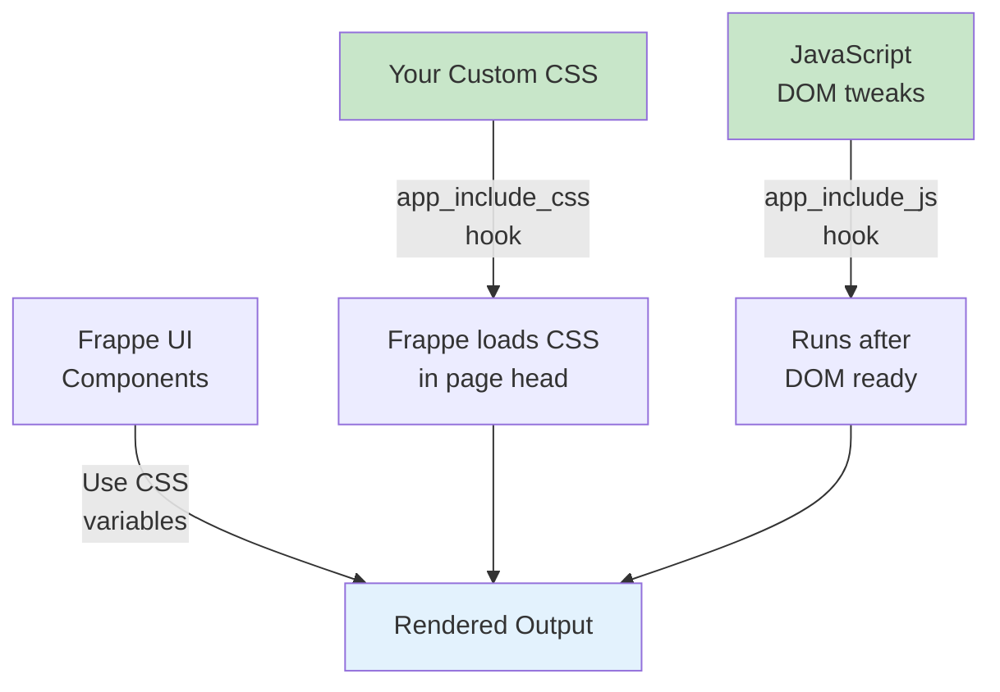

# Pattern 6: CSS & DOM Override

> Purely visual customization using CSS custom properties, injected stylesheets, and lightweight JavaScript. The safest and simplest pattern for changing how Frappe UI apps look.

---

## Table of Contents

- [What This Pattern Does](#what-this-pattern-does)
- [When to Use This Pattern](#when-to-use-this-pattern)
- [Why We Use This Pattern](#why-we-use-this-pattern)
- [Architecture](#architecture)
- [Techniques](#techniques)
- [Complete Code Examples](#complete-code-examples)
- [Frappe v16 CSS Custom Properties](#frappe-v16-css-custom-properties)
- [Scoped Style Injection](#scoped-style-injection)
- [Limitations](#limitations)

---

## What This Pattern Does

This pattern customizes the visual appearance of Frappe UI apps using:

1. **CSS Custom Properties** - Override Frappe's design tokens
2. **Injected Stylesheets** - Load custom CSS via `app_include_css`
3. **JavaScript DOM Manipulation** - Lightweight element modifications
4. **Theme Variants** - Dark mode, compact mode, brand theming

No Vue components are modified. No source code is copied. Only the presentation layer changes.

---

## When to Use This Pattern

| Use This Pattern | Don't Use This Pattern |
|-----------------|----------------------|
| Change colors, fonts, spacing | Add new functionality |
| Hide/show existing elements | Modify data flow |
| Reorder UI elements visually | Change routing |
| Add branding/logos | Add new form fields |
| Compact/dense layout mode | Custom validation logic |
| Responsive adjustments | New API calls |

---

## Why We Use This Pattern

| Advantage | Explanation |
|-----------|-------------|
| **Zero Maintenance** | CSS is surprisingly stable across versions |
| **Instant** | Changes apply on reload, no build needed |
| **Safe** | Can't break business logic |
| **Reversible** | Remove CSS and original look returns |
| **Performant** | Browsers optimize CSS extremely well |
| **Accessible** | Can improve contrast, focus states |

---

## Architecture



---

## Techniques

### Technique 1: CSS Custom Properties (Variables)

Frappe UI uses CSS custom properties for theming. Override them:

```css
:root {
    /* Frappe UI color overrides */
    --primary: #0f766e;              /* Brand primary */
    --primary-color: #0f766e;
    
    /* Surface colors */
    --surface-white: #fafaf9;
    --surface-gray-1: #f5f5f4;
    
    /* Text colors */
    --text-ink-gray-8: #1c1917;
    --text-ink-gray-5: #78716c;
    
    /* Border radius */
    --radius: 6px;
    --radius-lg: 10px;
}

/* Dark mode overrides */
[data-theme="dark"] {
    --surface-white: #1c1917;
    --surface-gray-1: #292524;
    --text-ink-gray-8: #fafaf9;
}
```

### Technique 2: Specific Component Overrides

```css
/* Make sidebar more compact */
.app-sidebar {
    --sidebar-width: 200px;
}

.app-sidebar .sidebar-link {
    padding: 6px 12px;
    font-size: 13px;
}

/* Highlight active deals */
.deal-card.status-active {
    border-left: 3px solid var(--primary);
}

.deal-card.status-won {
    border-left: 3px solid #22c55e;
}

.deal-card.status-lost {
    border-left: 3px solid #ef4444;
    opacity: 0.8;
}

/* Better form field focus states */
.form-control:focus {
    box-shadow: 0 0 0 3px rgba(15, 118, 110, 0.15);
    border-color: var(--primary);
}

/* Improve table readability */
.data-table th {
    background: var(--surface-gray-1);
    font-weight: 600;
    text-transform: uppercase;
    font-size: 11px;
    letter-spacing: 0.05em;
}

.data-table tr:hover {
    background: var(--surface-select);
}
```

### Technique 3: Hide Elements

```css
/* Hide elements without breaking layout */
.hide-for-sales-role .admin-only {
    display: none !important;
}

/* Hide specific CRM sections */
.crm-page .section-help {
    display: none;
}

/* Show only on hover */
.row-actions {
    opacity: 0;
    transition: opacity 0.2s;
}

tr:hover .row-actions {
    opacity: 1;
}
```

---

## Complete Code Examples

### Example 1: Complete Brand Theme

```css
/* public/css/brand-theme.css */

/* ============================================
   Brand Theme for Frappe CRM
   Company: Acme Corp
   Primary: Teal #0f766e
   ============================================ */

:root {
    /* Brand palette */
    --brand-primary: #0f766e;
    --brand-primary-light: #14b8a6;
    --brand-primary-dark: #115e59;
    --brand-secondary: #f59e0b;
    
    /* Override Frappe UI variables */
    --primary: var(--brand-primary);
    --primary-color: var(--brand-primary);
    
    /* Custom surface palette */
    --surface-page: #fafaf9;
    --surface-card: #ffffff;
    --surface-elevated: #ffffff;
    
    /* Shadows */
    --shadow-sm: 0 1px 2px rgba(28, 25, 23, 0.05);
    --shadow-md: 0 4px 6px -1px rgba(28, 25, 23, 0.08), 0 2px 4px -1px rgba(28, 25, 23, 0.04);
    --shadow-lg: 0 10px 15px -3px rgba(28, 25, 23, 0.08), 0 4px 6px -2px rgba(28, 25, 23, 0.04);
}

/* Page background */
.app-layout {
    background: var(--surface-page);
}

/* Cards and panels */
.card,
.form-section,
.info-panel {
    background: var(--surface-card);
    border: 1px solid #e7e5e4;
    border-radius: var(--radius-lg, 10px);
    box-shadow: var(--shadow-sm);
}

/* Primary buttons */
.btn-primary {
    background: linear-gradient(
        135deg, 
        var(--brand-primary) 0%, 
        var(--brand-primary-dark) 100%
    );
    border: none;
    font-weight: 500;
    letter-spacing: 0.01em;
}

.btn-primary:hover {
    background: linear-gradient(
        135deg, 
        var(--brand-primary-light) 0%, 
        var(--brand-primary) 100%
    );
    transform: translateY(-1px);
    box-shadow: var(--shadow-md);
}

/* Status badges */
.badge-success {
    background: #dcfce7;
    color: #166534;
    border: 1px solid #86efac;
}

.badge-warning {
    background: #fef3c7;
    color: #92400e;
    border: 1px solid #fcd34d;
}

.badge-error {
    background: #fee2e2;
    color: #991b1b;
    border: 1px solid #fca5a5;
}

/* Custom scrollbar */
::-webkit-scrollbar {
    width: 8px;
    height: 8px;
}

::-webkit-scrollbar-track {
    background: transparent;
}

::-webkit-scrollbar-thumb {
    background: #d6d3d1;
    border-radius: 4px;
}

::-webkit-scrollbar-thumb:hover {
    background: #a8a29e;
}

/* Form improvements */
.form-label {
    font-weight: 500;
    color: #57534e;
    font-size: 13px;
}

.form-control {
    border-color: #d6d3d1;
    transition: all 0.2s;
}

.form-control:focus {
    border-color: var(--brand-primary);
    box-shadow: 0 0 0 3px rgba(15, 118, 110, 0.1);
}

/* Table styling */
.table-container {
    border-radius: var(--radius-lg);
    overflow: hidden;
    border: 1px solid #e7e5e4;
}

.data-table thead th {
    background: #f5f5f4;
    font-weight: 600;
    font-size: 11px;
    text-transform: uppercase;
    letter-spacing: 0.05em;
    color: #78716c;
    padding: 10px 16px;
}

.data-table tbody td {
    padding: 12px 16px;
    border-bottom: 1px solid #f5f5f4;
}

.data-table tbody tr:last-child td {
    border-bottom: none;
}

.data-table tbody tr:hover td {
    background: #fafaf9;
}

/* Modal/dialog */
.modal-overlay {
    background: rgba(28, 25, 23, 0.4);
    backdrop-filter: blur(4px);
}

.modal-content {
    border-radius: var(--radius-lg);
    box-shadow: var(--shadow-lg);
}

/* Animations */
@keyframes fadeIn {
    from { opacity: 0; transform: translateY(8px); }
    to { opacity: 1; transform: translateY(0); }
}

.card {
    animation: fadeIn 0.3s ease-out;
}

/* Loading states */
.skeleton {
    background: linear-gradient(
        90deg,
        #f5f5f4 25%,
        #e7e5e4 50%,
        #f5f5f4 75%
    );
    background-size: 200% 100%;
    animation: shimmer 1.5s infinite;
}

@keyframes shimmer {
    0% { background-position: 200% 0; }
    100% { background-position: -200% 0; }
}
```

### Example 2: Role-Based Visibility

```css
/* public/css/role-based.css */

/* Sales reps see simplified view */
body[data-user-role*="Sales User"] .admin-panel,
body[data-user-role*="Sales User"] .advanced-settings,
body[data-user-role*="Sales User"] .audit-log {
    display: none !important;
}

/* Managers see everything */
body[data-user-role*="Sales Manager"] .manager-only {
    display: block !important;
}

/* Hide for all except administrators */
body:not([data-user-role*="System Manager"]) .admin-only {
    display: none !important;
}
```

```javascript
// public/js/role-based.js
// Add user role data to body for CSS targeting

(function() {
    function applyRoleClasses() {
        fetch('/api/method/frappe.auth.get_logged_user')
            .then(() => {
                // Get roles from frappe.boot
                if (window.frappe?.boot?.user?.roles) {
                    const roles = window.frappe.boot.user.roles.join(' ')
                    document.body.setAttribute('data-user-role', roles)
                }
            })
    }
    
    if (document.readyState === 'loading') {
        document.addEventListener('DOMContentLoaded', applyRoleClasses)
    } else {
        applyRoleClasses()
    }
})()
```

### Example 3: Compact Mode Toggle

```css
/* public/css/compact-mode.css */

/* Compact mode - activated by body class */
body.compact-mode {
    /* Reduced spacing everywhere */
    --spacing-xs: 2px;
    --spacing-sm: 4px;
    --spacing-md: 8px;
    --spacing-lg: 12px;
    --spacing-xl: 16px;
}

body.compact-mode .sidebar-link {
    padding: 4px 8px;
    font-size: 12px;
}

body.compact-mode .form-section {
    margin-bottom: 12px;
}

body.compact-mode .form-control {
    padding: 4px 8px;
    font-size: 13px;
}

body.compact-mode .data-table td,
body.compact-mode .data-table th {
    padding: 6px 10px;
    font-size: 12px;
}

body.compact-mode .card {
    padding: 12px;
}

body.compact-mode h1 { font-size: 1.25rem; }
body.compact-mode h2 { font-size: 1.125rem; }
body.compact-mode h3 { font-size: 1rem; }
```

```javascript
// public/js/compact-mode.js

(function() {
    // Check user preference
    const compactMode = localStorage.getItem('compact-mode') === 'true'
    if (compactMode) {
        document.body.classList.add('compact-mode')
    }
    
    // Add toggle button (example - adapt selector to your UI)
    function addToggle() {
        const header = document.querySelector('.app-header, .navbar')
        if (!header || header.querySelector('.compact-toggle')) return
        
        const btn = document.createElement('button')
        btn.className = 'compact-toggle btn btn-sm btn-default'
        btn.innerHTML = compactMode ? 'Comfort' : 'Compact'
        btn.title = 'Toggle compact mode'
        
        btn.addEventListener('click', () => {
            document.body.classList.toggle('compact-mode')
            const isCompact = document.body.classList.contains('compact-mode')
            localStorage.setItem('compact-mode', isCompact)
            btn.textContent = isCompact ? 'Comfort' : 'Compact'
        })
        
        header.appendChild(btn)
    }
    
    // Try to add toggle when DOM is ready
    if (document.readyState === 'loading') {
        document.addEventListener('DOMContentLoaded', addToggle)
    } else {
        addToggle()
    }
    
    // Retry for SPA navigation
    const observer = new MutationObserver(() => addToggle())
    observer.observe(document.body, { childList: true, subtree: true })
})()
```

### Example 4: Print Style Overrides

```css
/* public/css/print-styles.css */

@media print {
    /* Hide navigation and actions */
    .app-sidebar,
    .app-header,
    .page-actions,
    .btn,
    .fab,
    .modal {
        display: none !important;
    }
    
    /* Full width content */
    .main-content {
        margin: 0 !important;
        padding: 0 !important;
        max-width: 100% !important;
    }
    
    /* Ensure backgrounds print */
    * {
        -webkit-print-color-adjust: exact !important;
        print-color-adjust: exact !important;
    }
    
    /* Page breaks */
    .form-section {
        break-inside: avoid;
    }
    
    h1, h2 {
        break-after: avoid;
    }
    
    /* Clean table output */
    table {
        border-collapse: collapse;
    }
    
    th, td {
        border: 1px solid #ccc;
        padding: 8px;
    }
}
```

---

## Frappe v16 CSS Custom Properties

Common variables available for override in Frappe v16:

```css
:root {
    /* Primary brand color */
    --primary: #171717;
    --primary-color: #171717;
    
    /* Neutral scale */
    --neutral-black: #000000;
    --neutral-white: #ffffff;
    
    /* Ink (text) colors */
    --ink-black: #000000;
    --ink-white: #ffffff;
    --ink-grey: #666666;
    --ink-blue: #2d95f3;
    --ink-green: #2d9f5e;
    --ink-orange: #f5a623;
    --ink-red: #f56c6c;
    
    /* Surfaces */
    --surface-white: #ffffff;
    --surface-menu-bar: #f8f8f8;
    --surface-gray-1: #f4f4f4;
    --surface-gray-2: #efefef;
    --surface-gray-3: #e8e8e8;
    --surface-modal: #ffffff;
    
    /* Border */
    --border-color: #e2e2e2;
    
    /* Status colors */
    --green-100: #e6f5e6;
    --green-200: #a7d8a7;
    --green-300: #6bbf6b;
    --green-400: #3da83d;
    --green-500: #2d9f5e;
    
    --red-100: #ffe6e6;
    --red-200: #ffa7a7;
    --red-300: #ff6b6b;
    --red-400: #ff3d3d;
    --red-500: #f56c6c;
    
    /* Radius */
    --radius-sm: 4px;
    --radius: 6px;
    --radius-md: 8px;
    --radius-lg: 12px;
    --radius-xl: 16px;
    --radius-full: 9999px;
}
```

---

## Scoped Style Injection

For complex apps, scope your styles to specific pages:

```css
/* Only apply on CRM deal pages */
body[data-route^="crm/deals"] .deal-header {
    background: linear-gradient(135deg, var(--primary), var(--primary-dark));
    color: white;
    padding: 20px;
    border-radius: var(--radius-lg);
}

/* Only apply on lead pages */
body[data-route^="crm/leads"] .lead-score {
    display: inline-flex;
    align-items: center;
    gap: 4px;
    font-weight: 600;
}

/* Global but component-specific */
.app-sidebar .nav-icon {
    width: 18px;
    height: 18px;
}
```

---

## Limitations

1. **Can't Add New Elements** - Only style what exists
2. **Selector Fragility** - Class names may change in updates
3. **Specificity Wars** - May need `!important` to override inline styles
4. **JavaScript-Rendered Content** - Dynamic content may need JS hooks
5. **Scoped Styles** - Vue components with `scoped` CSS are harder to override

### Mitigation: Defensive CSS

```css
/* Use multiple selectors for resilience */
.deal-header,
[data-doctype="CRM Deal"] header,
#deal-page .header {
    /* styles */
}

/* Progressive enhancement - doesn't break if selector fails */
.custom-badge {
    display: inline-flex;
    align-items: center;
    padding: 2px 8px;
    border-radius: 9999px;
    font-size: 12px;
    font-weight: 500;
}

.custom-badge:empty {
    display: none;
}
```
